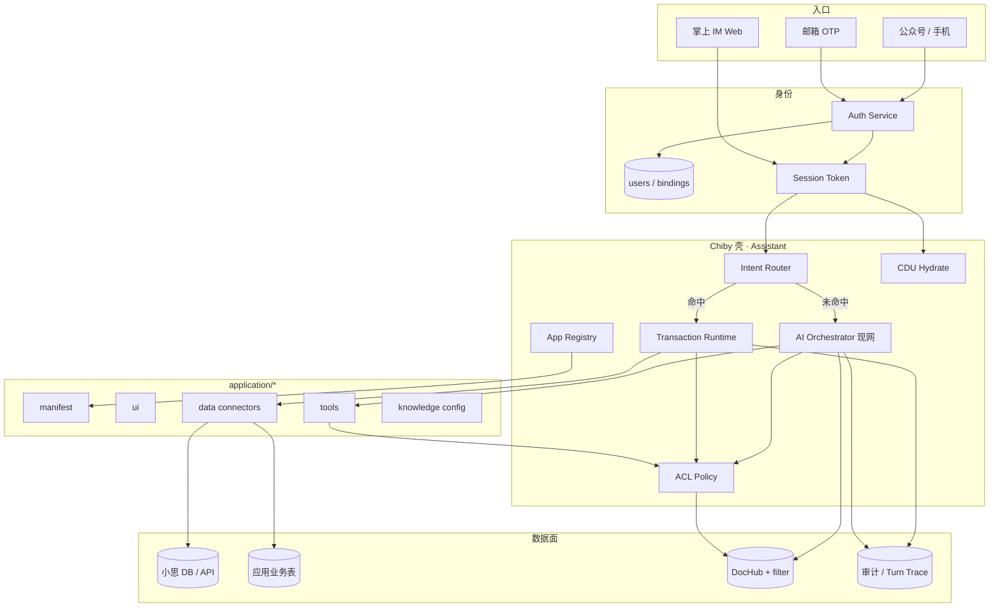
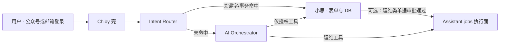
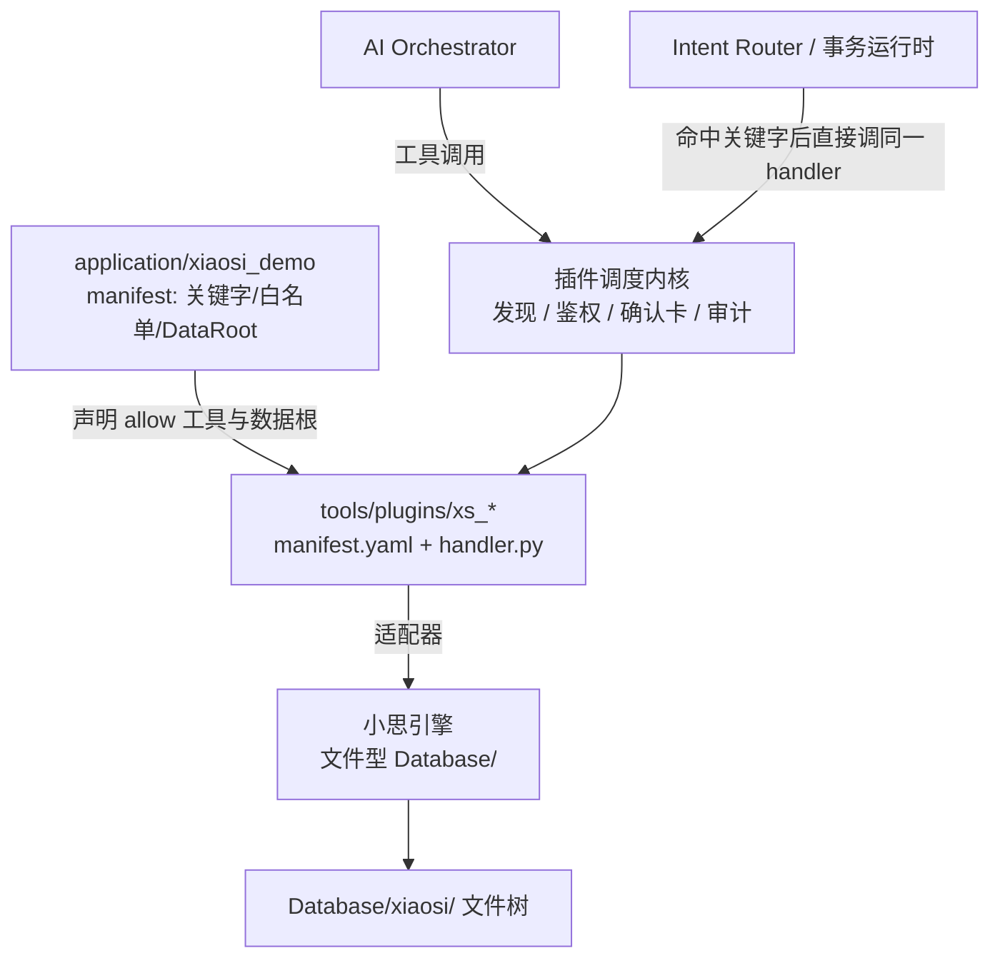

# Chiby（赤壁）通用应用平台 — 需求分析与开发设计

> 状态：**需求分析 + 开发设计（待实现）**  
> 日期：2026-07-28  
> 产品定位：在现有「掌上 AI 机房 / Hermes 宿主」之上，演进为 **事务优先的通用 AI 业务壳**  
> 关联：[chiby-technical-whitepaper.md](./chiby-technical-whitepaper.md) · [context-data-unit-architecture.md](./context-data-unit-architecture.md) · [tool-plugin-architecture.md](./tool-plugin-architecture.md) · [doc-hub-technical-design.md](./doc-hub-technical-design.md) · [mobile-multi-host-job-design.md](./mobile-multi-host-job-design.md) §9 小思 Job · [mobile-plan-tier-advanced-design.md](./mobile-plan-tier-advanced-design.md) · [tsm-a-security-model.md](./tsm-a-security-model.md)  
> **小思专章**：本文 **§6**（表单 / 关键字 / Database / 适配器契约）

**本稿不要求立即编码。** 实现应按文末分期推进；身份、应用目录、事务路由同里程碑落地，避免再造平行账号体系。

---

## 0. 一句话结论

> **Chiby = 统一登录 + 应用目录（配置 / 数据 / UI / 工具）+「小思关键字·事务优先，未命中再进 AI」的编排壳。**  
> 本地业务增强 = **ACL 过滤后的检索 / 工具 + 可选本地 LLM·Embedding（Ollama）**；  
> **不是**「一个自进化大模型自动懂权限」。

---

## 1. 背景与问题

### 1.1 现状（仓内已有）

| 能力 | 现状 | 缺口 |
|------|------|------|
| 对话编排 | `MobileSessionOrchestrator`、三模式、确认卡、Turn Trace | 无统一「业务应用」一等公民 |
| 工具 | `tools/plugins/` + 市场 Phase 6 | 工具按全局装载，缺按应用边界装载 |
| 上下文 | CDU（HostTargets 等）按 `external_user_id` 分桶 | 演示身份，非正式登录 |
| 知识 | KnowledgeHub + DocHub（embedding 可接 Ollama） | 缺应用级库隔离与检索 ACL |
| 小思 | Job API 路径 B 已设计（运维扇出）；**不迁 SsiForm** | **业务向**未接：表单 schema、关键字目录、单据 CRUD、用户映射（见 §6） |
| 登录 | 演示 `external_user_id` + 主机 ACL | 无公众号 / 邮箱 OTP 正式身份 |

### 1.2 产品要解决的问题

1. **确定性业务**（填单、查数、审批、落库）与 **开放式 AI 问答/编排** 如何同一入口共存，且不互相抢话？  
2. 如何在产生用户与业务数据时保证 **校验、权限、审计**，而不是模型直接写库？  
3. 「本地化、懂本企业」如何落地？向量 / 本地模型放哪一层？**不同用户看到不同数据**如何保证？  
4. 如何让多个业务（含小思能力）以 **可插拔应用** 形式进壳，而不是硬编码进编排器？  
5. 两种登录（公众号手机号、邮箱动态码）如何收敛到 **同一用户主键**，并与现有 CDU / ACL 对齐？

### 1.3 设计原则

| # | 原则 |
|---|------|
| P1 | **事务优先**：命中关键字 / 表单 / 已注册事务 → 确定性通道；否则 → AI 助手 |
| P2 | **身份先于数据**：一切用户分桶、ACL、CDU、向量 filter 挂在统一 `user_id` |
| P3 | **权限在数据面**：检索前过滤、工具按授权装载；禁止「全库检索后靠 prompt 瞒」 |
| P4 | **应用一等公民**：`application/<app_id>/` 声明配置、数据连接、UI、工具、路由 |
| P5 | **小思松耦合**：复用表单与 DB 能力；不强制合并小思代码仓（延续 Job 路径 B） |
| P6 | **自进化降级表述**：短期 = 知识沉淀 + 规则/提示词包；中长期才谈按租户 LoRA |
| P7 | **复用现网**：编排、插件、CDU、DocHub、TSM-A 确认与审计，不平行重造 |

---

## 2. 目标与非目标

### 2.1 目标

1. 统一身份：公众号手机号登录、邮箱 OTP 登录 → 内部 `user_id`，映射现有 `external_user_id`。  
2. 应用平台：`Assistant/application/` 下多应用清单驱动发现、路由、工具与 UI。  
3. **集成小思**：复用表单、关键字、事务与 Database；Chiby 做对话壳与路由（§6）。  
4. 双通道编排：**Intent Router**（小思事务优先）→ 成功则结束；否则 **AI Orchestrator**（现网路径）。  
5. 受控产数：业务写入经 **小思单据 API / 表单引擎**，带 schema、ACL、审计。  
6. 本地知识增强：每应用可选知识库；Embedding 可用 Ollama；查询强制 `tenant/app/acl` filter。  
7. 与套餐/模式闸门（Free/Pro）同一认证主体挂载（见 mobile-plan-tier 设计）。

### 2.2 非目标（本稿不做）

- 全量微调「自进化大模型」的训练流水线与算力编排  
- 用向量相似度替代行级权限  
- 迁移或重写小思 `SsiForm` 引擎进本仓  
- 支付 / 计费细则、微信商户号完整商业化  
- 替换 Hermes / 三模式执行平面  
- 多区域多活身份联邦（可预留 IdP 接口）

---

## 3. 需求分析

### 3.1 角色

| 角色 | 说明 |
|------|------|
| 终端用户 | 手机 / 浏览器登录，使用应用事务与 AI |
| 应用管理员 | 配置本应用表单、关键字、ACL、知识库 |
| 平台管理员 | 应用上架、登录通道、租户、审计保留 |
| 开发者 | 在 `application/<app_id>/` 交付 manifest、工具、UI |

### 3.2 功能需求

#### A. 身份与登录

| ID | 需求 | 优先级 |
|----|------|--------|
| FR-ID-01 | 支持 **微信公众号关注态 + 手机号** 登录（或公众号授权取号后建档） | P0 |
| FR-ID-02 | 支持 **邮箱接收动态码（OTP）** 登录 | P0 |
| FR-ID-03 | 两种方式绑定到同一内部 `user_id`；支持后续换绑策略 | P0 |
| FR-ID-04 | 会话签发短期 token / cookie；API 与 IM 演示统一消费 | P0 |
| FR-ID-05 | 未登录仅 `anon` 能力（可配）；登录后恢复 CDU / 应用偏好 | P0 |
| FR-ID-06 | OTP 频控、过期、防爆破；邮箱可配域名白名单 | P1 |
| FR-ID-07 | 与现网 `external_user_id` 映射表；主机 ACL 继续按该键或 `user_id` 别名 | P0 |

#### B. 事务优先路由

| ID | 需求 | 优先级 |
|----|------|--------|
| FR-RT-01 | 用户消息先经 **Intent Router**：关键字、正则、应用声明 intent、进行中事务续接 | P0 |
| FR-RT-02 | 命中则走表单填报 / 事务处理器 / 小思回调；**不进入** Agent 工具循环（除非事务显式委派） | P0 |
| FR-RT-03 | 未命中或用户明确「交给 AI」→ 现网 Orchestrator / Hermes | P0 |
| FR-RT-04 | 路由决策写入 Turn Trace（`route=transaction|agent`、`app_id`、`intent_id`） | P1 |
| FR-RT-05 | 冲突关键字按应用优先级 / 用户当前 `active_app` 消解 | P1 |

#### C. 应用目录与生命周期

| ID | 需求 | 优先级 |
|----|------|--------|
| FR-APP-01 | 目录 `application/<app_id>/` + `manifest.yaml` 自动发现 | P0 |
| FR-APP-02 | manifest 声明：标题、入口、关键字、工具白名单、CDU、数据源、知识库、UI 槽 | P0 |
| FR-APP-03 | 应用数据根指向工作区 `Database/<app>/`（小思为文件型布局）；源码树不提交业务对象文件 | P0 |
| FR-APP-04 | 应用级 UI：嵌入对话壳卡片 / 独立 demo 页 / 表单步骤条 | P1 |
| FR-APP-05 | 应用启用状态、版本、依赖（对齐工具市场 Phase 6 思路） | P1 |
| FR-APP-06 | 样板应用：至少 1 个「小思事务演示」+ 保留现网运维能力为 `app_ops`（或内置） | P0 |

#### D. 业务数据与产数

| ID | 需求 | 优先级 |
|----|------|--------|
| FR-DATA-01 | 事务写路径：schema 校验 → ACL → 写入 → 审计事件 | P0 |
| FR-DATA-02 | AI **不得**直接拿到 DB 连接；仅能调用应用暴露的 `app_*` 工具 | P0 |
| FR-DATA-03 | 读路径工具必须带当前 `user_id` 的行/对象过滤 | P0 |
| FR-DATA-04 | 支持「对话中生成草稿数据 → 用户确认卡 → 落库」（复用确认卡模式） | P1 |

#### E. 本地知识与「业务模型」增强

| ID | 需求 | 优先级 |
|----|------|--------|
| FR-KB-01 | 每应用可选 DocHub 集合或独立 collection：`app_id` + `tenant_id` metadata | P0 |
| FR-KB-02 | Embedding：复用 DocHub（litellm / **Ollama** / hash 降级） | P0 |
| FR-KB-03 | 检索 API / `doc_search`：**强制** ACL filter（用户可见 doc 集合） | P0 |
| FR-KB-04 | 「自进化」P0：成功事务摘要 / FAQ → 入应用知识库（人工或半自动审核） | P1 |
| FR-KB-05 | 「自进化」P2（可选）：按租户 LoRA / 提示词包；**仍不替代 ACL** | P2 |

#### F. 权限模型

| ID | 需求 | 优先级 |
|----|------|--------|
| FR-ACL-01 | 主体：`user_id`；客体：`app` / `intent` / `tool` / `record` / `doc` / `host` | P0 |
| FR-ACL-02 | 主机可见性延续现网 ACL；应用可见性独立表 | P0 |
| FR-ACL-03 | 向量检索与结构化查询共用同一 Policy 求值入口 | P0 |
| FR-ACL-04 | 越权尝试记审计 + 对用户可解释拒绝文案 | P1 |

#### G. 小思集成（摘要；细则 §6）

| ID | 需求 | 优先级 |
|----|------|--------|
| FR-XS-01～08 | 表单定义、关键字目录、单据 CRUD、审批状态、Database 权威、用户映射、行级权限透传、运维 Job 入口 | P0/P1/已有 |
| FR-XS-09 | 未命中小思关键字/事务时才进入 AI；命中则不进 Hermes 工具环 | P0 |
| FR-XS-10 | AI 产数仅能经确认卡 + 小思 API 落库，禁止模型直连业务库 | P0 |

### 3.3 非功能需求

| ID | 需求 |
|----|------|
| NFR-01 | 事务路径 P95 延迟明显低于完整 Agent 回合（目标：路由+表单响应 < 300ms 本地） |
| NFR-02 | 登录 OTP 与会话密钥可配置；密钥不入库明文 |
| NFR-03 | 应用热加载或进程重启加载；坏 manifest 隔离，不拖垮壳 |
| NFR-04 | 审计：登录、路由、事务写、工具调用、知识检索命中集摘要 |
| NFR-05 | 单机可演示；生产可外置 Postgres / 小思库 / Qdrant |

### 3.4 用户故事（摘要）

1. **运维员工**用邮箱 OTP 登录 → 打开运维应用 → 顶栏选机 → AI 查磁盘；展开历史执行结果不跳底（已有 UX）。  
2. **业务用户**关注公众号登录 → 说「请假」→ 命中关键字 → 弹出表单步骤 → 提交写入小思库；全程不进 Hermes。  
3. **同租户经理**说「查我团队请假」→ 事务或工具只返回 ACL 内记录；同事数据不可见。  
4. **管理员**上传本应用制度 PDF → 员工提问走 RAG；外包账号同一问题检索为空或拒答。

---

## 4. 总体架构

### 4.1 逻辑架构



### 4.2 请求主路径

```text
登录 → Session(user_id)
     → Hydrate CDUs + 可见 apps
     → 用户消息
           ├─ Intent Router 命中 → Transaction Runtime → 表单/写库/回调 → 结束
           └─ 未命中 → AI Orchestrator（工具白名单 = 当前 app ∪ 平台工具）
                        → 工具 / RAG 均经 Policy
```

### 4.3 与现网模块映射

| 新概念 | 落点（建议） |
|--------|----------------|
| Auth / Session | 新建 `terminal/auth/` 或 `chibycore/identity/`；演示 ACL 读映射后的 `external_user_id` |
| Intent Router | `terminal/mobile/intent_router.py`（类比已有 `doc_intent` 早拦截） |
| App Registry | `application/*/manifest.yaml` + `terminal/apps/registry.py` |
| Transaction Runtime | `terminal/apps/transaction.py`；小思经 HTTP/Job 适配器 |
| Policy | 扩展 `terminal/mobile/acl.py` → `policy.py`（app/doc/record） |
| 知识 ACL | DocHub metadata filter + 上传时写入 `acl_tags` |
| 工具装载 | 插件发现增加 `app_id` 作用域；全局运维插件挂 `app_ops` 或 `platform` |

---

## 5. 应用目录设计

### 5.1 目录约定

```text
Assistant/
  application/
    _template/                 # 脚手架
      manifest.yaml
      README.md
    xiaosi_demo/               # 样板：关键字 → 表单 → 小思库
      manifest.yaml
      intents/                 # 可选：intent 定义拆分
      ui/                      # 静态或模板片段
      tools/                   # 可选：本应用专用插件（或指向 tools/plugins）
      knowledge/               # 入库配置、acl 默认标签
      migrations/              # 可选：应用自有表
    ops_mobile/                # 可选：把现网掌上运维收编为应用（二期）
      manifest.yaml
  tools/plugins/               # 平台级 / 跨应用工具（保持现状）
  data/
    identity/                  # 用户、绑定、会话（或 SQLite）
    applications/              # 运行态覆盖（启用开关等）
```

### 5.2 `manifest.yaml` 契约（草案）

```yaml
app_id: xiaosi_demo
title: 小思事务演示
version: 0.1.0
status: approved          # draft | approved | disabled
priority: 100             # 关键字冲突时更大优先

identity:
  require_login: true

routing:
  keywords:
    - pattern: "请假|休假"
      intent: leave_request
    - pattern: "^查询单据"
      intent: order_query
  # 显式「AI」逃生
  agent_escape: ["交给助手", "用AI"]

intents:
  leave_request:
    type: form              # form | job | webhook | script
    form_ref: leave_v1      # 小思表单或本地 schema
    confirm: true
  order_query:
    type: tool
    tool: app_order_query

tools:
  allow:
    - app_order_query
    - search_knowledge      # 平台工具需显式允许
  deny:
    - remote_run            # 业务应用默认禁主机命令面

cdu:
  - unit_id: host_targets   # 可选；业务应用可空

data:
  backend: xiaosi           # xiaosi | sqlite | postgres
  connector_env: XIAOSI_DEMO_DSN
  # 禁止把生产库文件提交进 git

knowledge:
  collection: app_xiaosi_demo
  acl_default_tags: ["role:employee"]

ui:
  slots:
    - chrome_composer_hint
  demo_path: /demo/apps/xiaosi_demo
```

### 5.3 小思相关（概要）

小思是本平台的**业务表单与主数据核心**，不是可选项一句带过。分工、关键字、表单、Database、双向 API、身份与权限见 **§6 小思集成专章**。

| 方式 | 说明 | 阶段 |
|------|------|------|
| **A. 表单/事务 HTTP 适配器** | Intent → 小思表单定义与单据读写 | **P0 主路径（业务）** |
| **B. Job 复用** | 小思调 Assistant `jobs/*`（已有路径 B） | 运维扇出，保持 |
| **C. Database（文件型）** | 应用 `data.layout: files`；根目录 `Database/xiaosi`；经小思 API 读写 | P0 |
| **D. 本地镜像表** | 定时同步热点表到 Assistant | P1 可选 |
| **E. 合并代码仓 / 迁 SsiForm** | — | **明确不做** |

---

## 6. 小思（Xiaosi）集成专章

> 关联：[mobile-multi-host-job-design.md](./mobile-multi-host-job-design.md) §9（运维 Job 路径 B）。  
> 本章补齐原构思中「集成小思现有**表单、关键字、事务、Database**」——此前仅在应用目录里点到，此处作为一等需求展开。

### 6.1 产品分工（定稿）

| 系统 | 负责 | 不负责 |
|------|------|--------|
| **小思** | 表单引擎（SsiForm）、业务关键字/菜单、审批流、**业务主数据库**、企业微信等业务入口、工单对象 | 无头 SSH/WinRM、Hermes/三模式闭环、CDU 选机权威 |
| **Chiby / Assistant** | 统一登录壳、Intent Router、对话内表单卡片、AI 编排、运维执行平面、知识 ACL、审计/Turn Trace | 重写 SsiForm；不把生产业务库文件塞进本仓 |



**与路径 B 的关系**：  
- **业务事务**：Chiby → 小思（表单/DB）为主。  
- **运维多机任务**：小思 → Assistant `jobs/*` 为辅（已设计，可选）。  
两方向并存，互不替代。

### 6.1.1 定稿：小思 = 应用 + 标准工具插件（与其它工具同契约）

> **是的**：小思以 **应用（`application/xiaosi_*`）** 身份跑在赤壁之上；业务能力通过 **`tools/plugins/` 同一套契约** 暴露。赤壁（Agent / 事务运行时）调用小思工具，**与调用 `doc_search`、`host_list` 等其它插件同一调度路径**。



| 层级 | 小思怎么放 | 和别的工具是否一样 |
|------|------------|-------------------|
| **应用** | `application/xiaosi_demo/manifest.yaml`：路由关键字、`tools.allow`、`database_dir` | 与其它业务应用同一 App Registry |
| **工具** | `tools/plugins/xs_*`：标准 `manifest.yaml` + `handler.py` | **是**：同一加载器、风险级、确认卡、Turn Trace |
| **实现** | handler 内调小思适配器 → 写 `XIAOSI_DATA_ROOT` 文件树 | 类似 `doc_*` handler 调 DocHub |

**两路入口，一套工具：**

| 入口 | 行为 |
|------|------|
| **事务优先**（关键字命中） | Router **不经 LLM**，直接 `invoke(plugin, args)`——仍是同一插件 |
| **AI 助手**（未命中） | 模型在**当前应用白名单**内选工具，调度与其它插件完全相同 |

「像调用任何其他工具一样」= **契约与调度内核相同**；差别仅在：

1. 装载范围由应用 `tools.allow` / `deny` 裁剪；  
2. 关键字命中可短路进同一 handler，不必先让模型选工具；  
3. handler 背后是小思文件引擎，不是 SSH——对编排层仍是普通 tool result。

**不推荐**：为小思另搞私有 RPC、绕开 `tools/plugins/`（确认卡/审计/市场会分叉）。

### 6.2 要复用的小思能力（需求）

| ID | 能力 | Chiby 侧用法 | 优先级 |
|----|------|--------------|--------|
| FR-XS-01 | **表单定义**（字段、校验、可见性、联动） | Intent `type: form` 时拉取 schema，对话内逐步采集或一次填卡 | P0 |
| FR-XS-02 | **关键字 / 菜单事务** | 同步或配置映射到 `manifest.routing.keywords` → `intent` | P0 |
| FR-XS-03 | **单据提交 / 草稿** | Transaction Runtime `commit` → 小思 create/update API | P0 |
| FR-XS-04 | **审批状态** | 卡片展示 pending/approved/rejected；回调或轮询 | P1 |
| FR-XS-05 | **Database（文件型业务主数据）** | 查询/写入只经小思 API；物理文件在 `XIAOSI_DATA_ROOT`；禁止 Agent 直改文件 | P0 |
| FR-XS-06 | **用户/组织** | 与 Chiby `user_id` 映射（工号/手机/邮箱） | P0 |
| FR-XS-07 | **对象权限** | 小思行级权限为准；Chiby Policy 调用前透传身份，禁止绕过直连库 | P0 |
| FR-XS-08 | **运维 Job 入口** | 已有：`source: xiaosi_form` + `callback_url`（见 Job 设计 §9） | 已有 |

### 6.3 关键字与事务处理（核心路径）

原构思：「有效进行小思关键字和事务处理，不然则进行 AI 助手工作」。

```text
用户一句话
  → Router 查：当前用户可见应用中，是否命中小思关键字/进行中单据/显式菜单 intent
       ├─ 命中 → 打开或续接小思事务（表单采集 → 确认 → 写入小思 DB）
       │         · 不进入 Hermes / remote_tools 循环
       │         · 需要运维执行时：事务内「委派」→ 审批后调 jobs/run
       └─ 未命中 → AI 助手（可再通过 app 工具只读查小思，仍受 FR-XS-07）
```

**关键字来源（两级）**

| 来源 | 说明 |
|------|------|
| 应用 manifest | `routing.keywords` 静态配置（演示、无小思时也可跑） |
| 小思同步 | `GET` 小思「用户可见关键字/事务目录」→ 缓存进 App Registry（TTL 可配） |

冲突时：`active_app` > 小思返回优先级 > manifest `priority`。

### 6.4 表单在对话中的形态

| 模式 | 行为 | 适用 |
|------|------|------|
| **拉 schema 填卡** | Assistant 向小思取 `form_key` 定义 → IM 卡片分步/整表填写 → 提交 | P0 |
| **对话槽位填充** | AI/规则按字段提问，凑齐后预览确认再提交 | P1 |
| **跳转小思页** | 深链打开小思原表单，完成后 webhook 回写会话 | P1 兼容 |

提交成功后：会话气泡展示单据号；可选写入应用知识库「办理摘要」（人工审核后，见 §8 自进化）。

### 6.5 Database：权威、访问与「生成业务数据」

> **定稿补充**：小思业务数据是 **文件型数据组织**（目录 + 对象文件 / 索引文件），不是「必须先上 SQL 库」。文中 `Database/` 指 **工作区数据根目录**，其下按小思既有文件布局存放。

| 问题 | 决议 |
|------|------|
| 业务数据形态 | **文件型**：按对象/表单/用户等规则落盘（如目录树、单据文件、附件、索引）；由小思引擎读写 |
| 业务数据权威源 | **小思文件库（引擎仍属小思）** |
| 文件落盘位置 | **默认落在当前 Assistant 工作区的 `Database/`**（见 §6.5.1），不随小思安装目录漂移 |
| Assistant `application/*/data` | 只放连接/根路径配置与映射；**真实业务文件在 `Database/`**，gitignore |
| AI「生成用户和业务数据」 | 生成 **草稿** → 确认卡 → 小思 API（由小思写成文件）；**禁止** Agent 直接扫盘改业务文件 |
| 查询 | 经小思 Query/List API（内部读文件并做权限过滤）；Chiby 不直接 `open()` 业务对象文件 |
| 例外 | 平台只读「导出/镜像」可另议；默认关闭直连文件系统 |

```text
application/xiaosi_demo/manifest.yaml
  data:
    backend: xiaosi
    layout: files                 # 文件型组织（非 sql）
    base_url_env: XIAOSI_API_BASE
    # 数据根：相对 Assistant 根；小思进程启动必须指向同一绝对路径
    database_dir: Database/xiaosi
    # 可选：与小思约定的子布局名（示例，以小思现网为准）
    # objects_subdir: objects
    # index_subdir: index
    # root_env: XIAOSI_DATA_ROOT   # 优先于 database_dir 拼接
```

#### 6.5.1 文件型布局与「写到当前工作区 `Database/`」

**原则**：小思代码仓独立；**数据根目录（Data Root）由 Chiby 工作区指定**。所有建单/改单仍经小思 API，小思把文件写到该根下；Chiby 适配器不绕过引擎直接改文件。

```text
d:\Open\Assistant\                      ← CHIBY_ROOT
  Database\                             ← 工作区数据根（gitignore）
    xiaosi\                             ← XIAOSI_DATA_ROOT（= 小思 trunk 的 DataBase 镜像或挂载）
      Object\                           ← 对象类型模板 *.ini（leave/task/contract…）
      YYYY\MM\*.ini                     ← 对象实例（按年/月）
      Staff\*.tsk                       ← 人员待办事务
      Report\                           ← 报表模板 xlsx
      share.ini / objectIdx.dat         ← 共享与索引辅助
      *.xlsx                            ← 工资表等业务附件（亦常落在年/月下）
  application\xiaosi_demo\manifest.yaml
  terminal\apps\xiaosi_adapter.py       ← HTTP / 进程内封装 → SsiMain.ProcessMessage 或对象 API
```

> **现网实证**（`D:\Code\robot\trunk`）：见 **§6.12**。示意中的 `objects/index/forms` 已废弃，以 `Object/` + `年/月/` + `object-index.json` 为准。

| 做法 | 怎么保证落在本仓 |
|------|------------------|
| **A. 数据根环境变量（推荐）** | 将小思 `sys.path[0]/DataBase` 指到 `<CHIBY_ROOT>/Database/xiaosi`（启动 cwd / 软链 / 配置） |
| **B. 工作区启动脚本** | 在 Assistant 根拉起小思 Web（`SsiWebMain`），保证相对路径 `DataBase/` 落在挂载根 |
| **C. Docker 同卷** | mount `./Database/xiaosi:/app/DataBase` |
| **D. Mock** | 仅复制少量 `Object/*.ini` + 空 `年/月` 做联调 |

**验收**：提交请假后出现 `Database/xiaosi/<年>/<月>/<id>.ini`，且 `object-index.json`（或索引）更新；小思安装目录不再另有主数据树。

**注意**：始终用绝对数据根；**禁止** Agent 直接读写他人 `.ini`；权限必须经 `SsiObject.GetAccessList` / `ProcessMessage` 路径。

```text
CHIBY_ROOT=d:/Open/Assistant
XIAOSI_DATA_ROOT=${CHIBY_ROOT}/Database/xiaosi
XIAOSI_API_BASE=http://127.0.0.1:9xxx
```

### 6.6 适配器 API 契约（基于 trunk 现状 + Chiby 封装）

Chiby 侧：`terminal/apps/xiaosi_adapter.py`；工具：`tools/plugins/xs_*`。

**现网已有 HTTP（Flask · `SsiWebMain`）**

| 能力 | 路径 | 鉴权 | 说明 |
|------|------|------|------|
| 对话事务 | `POST /api/chat` | **Session 登录**（手机号/微信等） | 内部 `SsiMainSession.ProcessMessage`；适合人机，**不宜**直接给 Agent 长期调用 |
| 登录 OTP | `/api/login/send_code`、`/api/login` | — | 与赤壁邮箱/公众号登录可映射 |
| 附件 | `/api/chat/upload`、`/api/chat/file` | Session | 落盘 `DataBase/年/月/` |
| 企微回调 | `/api/wecom/callback` | 企微签名 | 桥接同一 `ProcessMessage` |

**尚缺（Docs 曾建议、源码未落地）**：API Key 版 **Plugin Gateway**（`ssi_query` / `ssi_report` / `ssi_push`）。赤壁对接时二选一：

| 方案 | 做法 | 推荐 |
|------|------|------|
| **A. 小思侧补 Gateway** | 在 Flask 上加 `/api/plugin/*` + API Key，工具化查询/建单 | 中长期 |
| **B. Chiby 薄封装（P0）** | `xs_*` handler 调小思 **进程内** `SsiMain`/`SsiObject`（同机旁路），或受控 Session/`remarkName` 调 `/api/chat` | **短期** |

推荐工具面（映射现网能力，而非臆造 REST）：

| Chiby 工具 id | 背后小思能力 |
|---------------|--------------|
| `xs_keyword_dispatch` | `SsiOperate.GetOperateItem` + `ProcessOneItem` |
| `xs_form_start` / `xs_form_step` | `SsiForm` / 对象 `OneForm` 多轮 |
| `xs_object_get` / `xs_object_search` | `SsiObjectIndex` + 权限过滤后的查询 |
| `xs_task_list` | `事务` → `SsiStaffObjectTask` / `Staff/*.tsk` |
| `xs_chat`（兜底） | `POST /api/chat` 全文对话（调试用） |

身份：小思主体为 **人员备注名 `remarkName`（中文名）**；与 Chiby `user_id` 经绑定表映射。

**无小思时**：`CHIBY_XIAOSI_MOCK=1` 用精简 `Object/*.ini` + `Database/xiaosi/年/月/` 文件模拟。

### 6.7 身份对齐

| Chiby | 小思 | 策略 |
|-------|------|------|
| `user_id` | （内部） | 映射表 `user_id ↔ remarkName` |
| 手机号 / 邮箱 | Web 登录字段 | 首次登录自动绑定或管理员绑定 |
| `remarkName`（人员中文名） | **小思会话主语** | 一切 `ProcessMessage` / 权限按此名 |
| `external_user_id` | 可选别名 | 运维 ACL、Job、CDU 继续用 |

未绑定小思用户：仅允许 AI 与无小思依赖应用；命中小思关键字时提示「请先绑定业务账号」。

### 6.8 权限（小思数据如何按人隔离）

1. **列表/详情**：只调小思 API，信任其行级权限；Chiby 不缓存全表再过滤。  
2. **向量知识**：制度类进 DocHub 时打 `acl_tags`；**单据正文默认不进向量库**（防越权语义检索）；若要入，必须带 `owner_id`/`doc_acl` 且检索强制 filter。  
3. **工具**：`app_order_query` 等在服务端注入当前用户，LLM 不能传「查全公司」。  
4. **运维 Job**：仍按 [Job 设计](./mobile-multi-host-job-design.md) — Assistant ACL 再滤主机；凭据不经小思。

### 6.9 端到端场景

**场景 A — 纯业务事务（不进 AI）**

```text
用户: 我要请假
Router → intent leave_request → 拉小思 leave 表单
卡片填写 → 确认 → POST documents → 小思落库 / 进审批
气泡: 已提交单号 leave-20260728-001
```

**场景 B — 业务单据触发运维（小思 → Job）**

```text
小思审批「巡检 nginx」通过
→ POST /api/mobile/jobs/run (source=xiaosi_form, host_ids=…)
→ Assistant 扇出执行 → callback_url 回写小思工单
```

**场景 C — AI 协助产数（受控）**

```text
用户: 根据刚才聊天帮我起草一份访客申请
AI 生成字段草稿 → 确认卡展示 → 用户点允许
→ xs_* 工具 / ProcessMessage（非模型直改 ini）
```

**场景 D — 未命中关键字**

```text
用户: 今天天气怎么样 / 帮我看看 yl 内存
→ AI Orchestrator（运维类走选机与 remote 工具；与小思无关）
```

### 6.10 小思侧待提供清单（开放依赖）

| # | 项 | 阻塞 |
|---|-----|------|
| 1 | ~~臆造 CRUD REST~~ → 改为复用 `ProcessMessage` 或补 Plugin Gateway | M4 |
| 2 | `operate.ini` 关键字导出或只读接口（供 Intent Router 同步） | M3 |
| 3 | `remarkName` ↔ 手机/邮箱绑定约定 | M1 |
| 4 | 可选：API Key Gateway（查对象/报表/推送） | M4+ 更干净 |
| 5 | 数据根可配置为外部绝对路径（便于挂 `Database/xiaosi`） | 部署 |

M3 可用 Mock；M4 优先同机旁路 `ProcessMessage`。

### 6.11 代码与配置落点（小思）

| 项 | 路径 |
|----|------|
| 适配器 | `terminal/apps/xiaosi_adapter.py` |
| Mock | `terminal/apps/xiaosi_mock/` 或 `data/xiaosi_mock/` |
| 样板应用 | `application/xiaosi_demo/` |
| 环境变量 | `XIAOSI_API_BASE`、`XIAOSI_DATA_ROOT`、`CHIBY_XIAOSI_MOCK` |
| Job 回调 | 已有 `callback_url`；业务单据钩子可后续补 |

### 6.12 小思源码速查（`D:\Code\robot\trunk`，2026-07-28）

> 只读聚焦：DataBase 布局、关键字、表单、权限、HTTP。结论已反哺 §6.1.1 / §6.5 / §6.6。

#### A. 文件型 DataBase（实证）

| 路径 | 作用 |
|------|------|
| `DataBase/Object/*.ini` | **对象类型模板**（约 33 种：`leave`/`task`/`contract`/…） |
| `DataBase/<年>/<月>/<对象ID>.ini` | **对象实例**（业务主数据） |
| `DataBase/Staff/<姓名>.tsk` | 人员待办（事务列表） |
| `DataBase/Report/` | 报表 xlsx 模板 |
| `DataBase/share.ini`、`objectIdx.dat` | 共享与索引辅助 |
| 根目录 `object-index.json` | 全局对象索引：`id → {name, ower, type, who[]}`（体量大） |

模板与实例关系见 `SsiObject.py` 文件头注释；请假模板见 `DataBase/Object/leave.ini`（`[Form]` 字段 + `[Unit1]/[Unit2]` 审批）。

#### B. 关键字 → 事务

| 机制 | 位置 | 行为 |
|------|------|------|
| 操作关键字/表单入口 | `Data/operate.ini` `[form]` | 如 `我要请假`、`新建`、`查询`、`自我提问`；含 `object-file` / `option-section` / 审批 JSON |
| 角色可见关键字 | `operate.ini` `[authority]` | 按部门角色裁剪菜单项 |
| 分词匹配 | `SsiOperate.GetOperateItem` | jieba 匹配关键字 → 打开 form 或 `SsiObject` |
| 对象名直达 | `GetIsCanCreatorObject` | 关键字命中对象显示名则进对象菜单 |
| 命令映射 | `commap.json` | 少数运维命令/函数（帮助、svn up 等） |
| 主循环 | `SsiMain._ProcessMessageLocked` | 进行中会话 → `commap` → `事务` → `GetOperateItem` → 否则闲聊 `SsiGetAnswerEx` |

与赤壁对齐：Intent Router 的关键字表 **优先同步 `operate.ini [form]` + `[authority]`**，不要只靠静态 manifest。

#### C. 表单与建单主路径

```text
用户消息
  → SsiMain.ProcessMessage(chatMsg)   # remarkName = 人员名
  → GetOperateItem / ProcessOneItem
       ├─ 旧式 form：BuildForm → SsiForm 多轮控件 → 写 dst-path（常为人员 Monthly ini）
       └─ 对象式：SsiObject.ProcessInit → 菜单 #form → OneForm
            → 写 DataBase/年/月/id.ini + 更新索引 + Staff.tsk 待办
            → Unit 审批 who=leader.… / 固定人
```

入口统一：**`ProcessMessage`**（Web `/api/chat`、企微 Bridge、itchat 均复用）。

#### D. 权限（不同用户不同数据）

| 层 | 实现 |
|----|------|
| 菜单/关键字 | `operate.ini` `[authority]` + `CheckAuthority` |
| 对象创建权 | 模板 `[Creator] permission`（department/jobs/person） |
| 实例操作权 | `SsiObject.GetAccessList`：Creator / Ower / UnitN.who；人员角色来自 **SsiStaff**（department/jobs），不再只靠 operate 部门表 |
| 索引可见 | `object-index.json` 的 `who[]` / `ower`；查询路径经引擎过滤 |
| 超级管理员 | 代码常量「超级管理员」放宽 |

**含义**：赤壁侧绝不能「读全库 ini 再靠 prompt」；必须带 `remarkName` 走小思引擎。

#### E. 对外入口

| 已有 | 未落地 |
|------|--------|
| Flask `SsiWebMain`：`/api/chat`（Session）、登录、上传下载、企微 `/api/wecom/*` | Docs 规划的 **Plugin Gateway + API Key**（源码无 `ssi_query` 等） |
| 核心可复用：`SsiMainSession.ProcessMessage` | 结构化 REST 建单/查单需补或由 Chiby 进程内封装 |

#### F. 对赤壁落地的直接建议

1. **数据根**：`XIAOSI_DATA_ROOT` → 工作区 `Database/xiaosi`，内容布局与 trunk `DataBase/` 一致（可 junction/复制 Object 模板）。  
2. **工具插件**：`xs_*` 封装 `ProcessMessage` / `SsiObject` / 索引查询，不要另造文件协议。  
3. **事务优先**：关键字表从 `operate.ini` 生成；命中后短路调用同一 `xs_*`。  
4. **身份**：绑定 `user_id ↔ remarkName`（小思人员名）。  
5. **M4**：优先同机旁路或 Session 代理；并行推动小思 Plugin Gateway 更干净。

---

## 7. 身份设计

### 7.1 模型

```text
user_id          内部主键（UUID）
bindings         phone | wechat_openid | email  → user_id
external_user_id 兼容现网 ACL / CDU 的字符串（可 = user_id 或映射表）
session          token → user_id, expires_at
xiaosi_user_id   可选映射（见 §6.7）
```

### 7.2 登录流

**邮箱 OTP**

```text
POST /api/auth/email/request  { email }  → 发码（限流）
POST /api/auth/email/verify   { email, code } → 建/绑用户 → Set-Cookie / token
```

**公众号 + 手机号**

```text
用户关注 / 扫码 → 公众号侧拿到 openid（及合规下的手机号）
POST /api/auth/wechat/bind-or-login { openid, phone?, code? }
  → 建/绑 user_id → 会话
```

实现可先 **Webhook 模拟器 + 人工绑号** 打通演示，再接真实公众号。

### 7.3 与 CDU / ACL

- 登录后所有 API 以会话解析 `user_id`，再映射 `external_user_id`。  
- CDU 键继续：`cdu:{assistant}:{external_user_id}:{unit}`（见 CDU 文档）。  
- 出现「同一登录多角色切换」需求时，再扩展 `persona_id`（CDU 文档已预留），**首期不做**。  
- 登录成功后尽量完成 **小思用户绑定**（§6.7），否则小思事务类 intent 降级提示。

---

## 8. 权限与「不同用户不同数据」

### 8.1 为何不能靠 Ollama 向量模型

| 错误做法 | 后果 |
|----------|------|
| 全租户一个向量库，靠 prompt「不要泄露」 | 必泄露 |
| 按用户训一个模型记数据 | 无法实时 ACL、无法审计、成本爆炸 |
| 用 embedding 距离当权限 | 语义相近 ≠ 有权访问 |

### 8.2 正确分层

```text
① Policy.evaluate(user, action, resource) → allow/deny + filter
② 结构化查询：小思 API 行级权限（主）或 WHERE 注入 filter
③ 向量检索：metadata filter（app_id, tenant_id, acl_tags ⊆ user.tags）
④ LLM：只看见 ②③ 返回的片段；工具列表已按 app+policy 裁剪
⑤ Ollama：仅提供 embedding / 可选 chat 推理，不参与授权
```

### 8.3 DocHub 扩展（最小）

上传 / 切片 metadata 增加：

```json
{
  "app_id": "xiaosi_demo",
  "tenant_id": "t1",
  "acl_tags": ["role:employee", "dept:hr"]
}
```

`doc_search` / `search_knowledge`：服务端合并 `user.acl_tags`，**无 overlap 则不可见**。  
**小思业务单据默认不向量化**（§6.8）；制度/手册类文档才进应用 collection。  
开发模式可用 hash embedding；生产 Ollama 与现 DocHub 设计一致。

### 8.4 「本地化业务自进化」分期定义

| 阶段 | 含义 | 交付物 |
|------|------|--------|
| P0 | 本地可跑 + 权限检索 | Ollama embedding、应用 collection、ACL filter |
| P1 | 经验闭环 | 小思成功事务摘要 → 待审知识条目；提示词包按 `app_id` |
| P2 | 轻量专模 | 租户 LoRA / 适配器；推理仍走 Policy 后的上下文 |
| 不做 | 无审计的在线自改权重、模型内藏机密行数据 | — |

---

## 9. Intent Router 与事务运行时

### 9.1 路由伪代码

```text
function handle_message(session, text, ui_context):
  if session.active_transaction:
    return resume_transaction(session.active_transaction, text)

  if matches_agent_escape(text):
    return ai_orchestrator(session, text)

  hits = registry.match_intents(session.visible_apps, text)
  # hits 含 manifest 关键字 ∪ 小思同步的 intent 目录（§6.3）
  if hits:
    intent = disambiguate(hits, session.active_app)
    return start_transaction(session, intent)  # 常经 xiaosi_adapter

  return ai_orchestrator(session, text)
```

### 9.2 与 `doc_intent` 关系

现有「文档意图早拦截」并入 Router 的 **平台级 intent**（`app_id=platform` 或 `ops_mobile`），避免多层拦截顺序混乱。顺序建议：

1. 进行中事务续接（含小思单据多轮）  
2. **小思关键字 / 表单 intent**（§6）  
3. 平台文档 / 运维快捷 intent  
4. AI Orchestrator  

### 9.3 事务状态

```text
idle → collecting (表单多轮) → confirming → committing → done
                              ↘ cancelled
```

`committing`：调用小思 Create/Submit；失败可重试；状态进 Turn Trace（含 `xiaosi_document_id`）。  
卡片 UI 复用确认卡信息层级。

---

## 10. API 草案（P0）

| 方法 | 路径 | 说明 |
|------|------|------|
| POST | `/api/auth/email/request` | 发邮箱 OTP |
| POST | `/api/auth/email/verify` | 验码登录 |
| POST | `/api/auth/wechat/login` | 公众号通道登录（可先 stub） |
| POST | `/api/auth/logout` | 注销会话 |
| GET | `/api/auth/me` | 当前用户与绑定（含 `xiaosi_bound`） |
| POST | `/api/auth/xiaosi/bind` | 绑定小思账号 |
| GET | `/api/apps` | 当前用户可见应用列表 |
| GET | `/api/apps/{app_id}` | 应用详情（脱敏 manifest） |
| POST | `/api/apps/{app_id}/intents/{intent_id}/start` | 显式开事务（UI 按钮） |
| GET | `/api/apps/{app_id}/transactions/{tid}` | 事务状态 |
| POST | `/api/apps/xiaosi/hooks/status` | 小思审批/单据状态回调 |
| GET | `/api/apps/xiaosi/health` | 适配器联调 |
| POST | `/api/mobile/demo/chat`（现有） | 请求头带 Session；服务端先 Router |
| POST | `/api/mobile/jobs/*`（现有） | 小思 → 运维 Job（路径 B） |

---

## 11. 数据模型（首期 SQLite 可演示）

```text
users(user_id PK, display_name, created_at, status)
user_bindings(binding_id, user_id, type, value_hash, value_norm, verified_at)
user_xiaosi_map(user_id, xiaosi_user_id, bound_at)
sessions(session_id, user_id, token_hash, expires_at)
user_acl_hosts(user_id, host_id)          -- 或继续用现有 ACL 文件 + 映射
user_acl_apps(user_id, app_id, role)
user_acl_tags(user_id, tag)               -- 供 DocHub filter
otp_challenges(id, channel, target_hash, code_hash, expires_at, attempts)
transactions(tid, user_id, app_id, intent_id, xiaosi_document_id, status, payload_json)
audit_identity / 复用 mobile audit JSONL
```

业务表：**权威在小思库**；Assistant 仅存事务运行态、用户映射与可选 Mock。

---

## 12. 安全与合规

| 项 | 要求 |
|----|------|
| OTP | 哈希存储、短 TTL、次数上限、同目标冷却 |
| 会话 | HttpOnly Cookie 或 Bearer；旋转刷新可选 |
| 公众号 | 遵循微信取号与隐私合规；本仓不存多余 PII |
| 小思凭证 | API Token / mTLS 仅服务端；不进前端、不进模型上下文 |
| 工具 | 业务应用默认不加载 `remote_run` 等命令面 |
| 产数 | 高风险字段变更走确认卡（对齐 TSM-A）；落库只经小思 API |
| 审计 | 登录失败、越权检索、事务提交、小思回调必记 |

---

## 13. 分期与验收

### 13.1 里程碑

| 阶段 | 内容 | 验收 |
|------|------|------|
| **M0** | 本文评审定稿；目录脚手架 `_template` + `xiaosi_demo` 骨架 | 文档入索引；样例 manifest 可人工读 |
| **M1 身份** | 邮箱 OTP + 会话；映射 `external_user_id`；`/me` | 登录后 CDU 按用户恢复；未登录 anon |
| **M2 应用壳** | App Registry 加载；`GET /api/apps`；聊天带 `app_id` | 禁用应用不可见 |
| **M3 事务路由** | Intent Router + 表单多轮（**Xiaosi Mock** 即可） | 「请假」走表单不进 Agent；Trace 有 `route=transaction` |
| **M4 小思适配** | 真实/契约 API：schema、建单、查询；用户绑定 | 提交后小思侧可见；越权查单 403 |
| **M5 知识 ACL** | 应用 collection + filter；Ollama embedding 可选 | 用户 A/B 同问异果；单据不默认入向量 |
| **M6 公众号登录** | 真实或沙箱公众号绑手机 | 与邮箱账号可合并绑定 |
| **M7 收编运维** | `ops_mobile` 应用化（可选）；小思 Job 回调联调 | 运维工具仅在该 app 白名单；工单回写成功 |

### 13.2 测试要点

- 路由：小思关键字命中 / 逃生词 / 进行中事务续接  
- 小思：建单、列表仅本人、详情越权、回调更新卡片  
- ACL：跨用户读单据、跨用户 doc_search  
- 身份：OTP；双通道绑定；小思账号绑定  
- 回归：`CHIBY_APP_PLATFORM=0` 时现网运维演示仍可用；Job 路径 B 不回退  

### 13.3 Feature Flag

```text
CHIBY_APP_PLATFORM=0|1
CHIBY_AUTH_EMAIL_OTP=0|1
CHIBY_AUTH_WECHAT=0|1
CHIBY_INTENT_ROUTER=0|1
CHIBY_XIAOSI_MOCK=0|1
CHIBY_XIAOSI_ADAPTER=0|1
```

默认关闭，避免打断现网掌上演示。

---

## 14. 风险与开放问题

| 风险 / 问题 | 倾向决议 | 待拍板 |
|-------------|----------|--------|
| **小思 API 形态与稳定性** | M3 Mock；M4 按 §6.6 契约联调 | **小思侧接口清单与负责人** |
| 关键字权威在小思还是 manifest | 运行时以小思目录优先，manifest 兜底 | 同步频率 |
| 公众号主体与资质 | M6 再接；M1 先邮箱 | 服务号 / 订阅号 |
| 运维是否立即应用化 | M7 可选；先并行 | 是否影响现网路径 |
| 多应用关键字冲突 | `priority` + `active_app` | UI 是否要应用切换器 |
| Free/Pro 与登录 | 同一 `user_id` 挂 `plan` | 与 mobile-plan-tier 同里程碑 |
| 小思与 hosts 主数据 | 执行权威仍在 Assistant `hosts.json` | 资产同步方向 |

---

## 15. 文档与代码落点清单（实现时）

| 项 | 路径 |
|----|------|
| 本设计 | `docs/chiby-app-platform-design.md`（**§6 小思专章**） |
| 应用根 | `application/`（含 `xiaosi_demo/`） |
| 注册表 | `terminal/apps/registry.py` |
| 小思适配器 | `terminal/apps/xiaosi_adapter.py` |
| 路由 | `terminal/mobile/intent_router.py` |
| 身份 | `terminal/auth/`（或 `chibycore/identity/`） |
| Policy 扩展 | `terminal/mobile/acl.py` → 演进 |
| DocHub filter | `chibycore/doc_hub/` + `doc_tools` |
| 运维 Job（小思→Chiby） | 已有 `docs/mobile-multi-host-job-design.md` §9 |
| 开关与索引 | `docs/index.md`、白皮书「应用平台」小节回链 |

---

## 16. 修订记录

| 日期 | 版本 | 说明 |
|------|------|------|
| 2026-07-28 | v0.1 | 首版：需求分析 + 开发设计 |
| 2026-07-28 | v0.2 | **增补 §6 小思集成专章**（表单/关键字/DB/适配器/场景/待提供清单）；原身份章起顺延编号 |
| 2026-07-28 | v0.3 | §6.5.1：小思独立进程时，业务库强制落盘当前工作区 `Database/`（DSN/同卷/启动脚本） |
| 2026-07-28 | v0.4 | §6.5：明确小思为**文件型数据组织**；`XIAOSI_DATA_ROOT` + 禁止 Agent 直改业务文件 |
| 2026-07-28 | v0.5 | §6.1.1：定稿小思=应用+`tools/plugins` 同契约；事务短路与 AI 共用 handler |
| 2026-07-28 | v0.6 | **§6.12 源码速查**（trunk）：DataBase ini 布局、operate 关键字、ProcessMessage、权限、Flask；修正适配器契约 |
