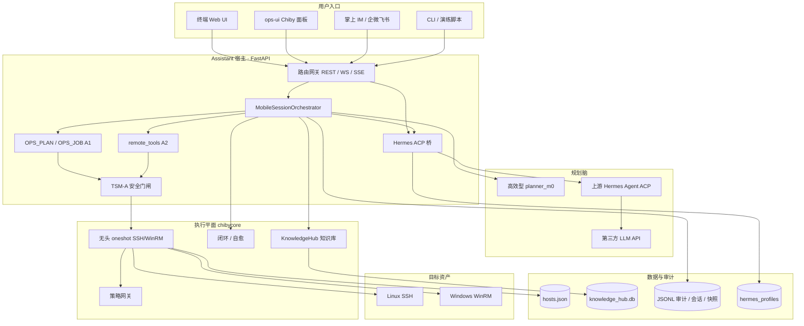
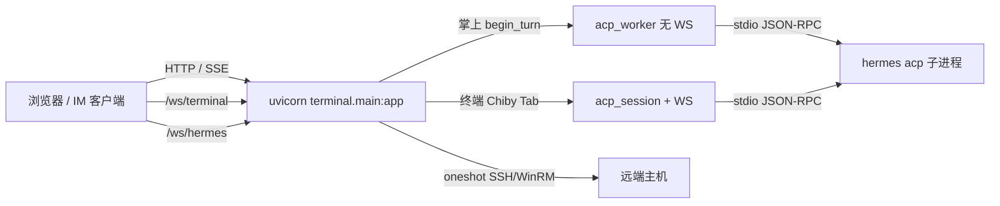
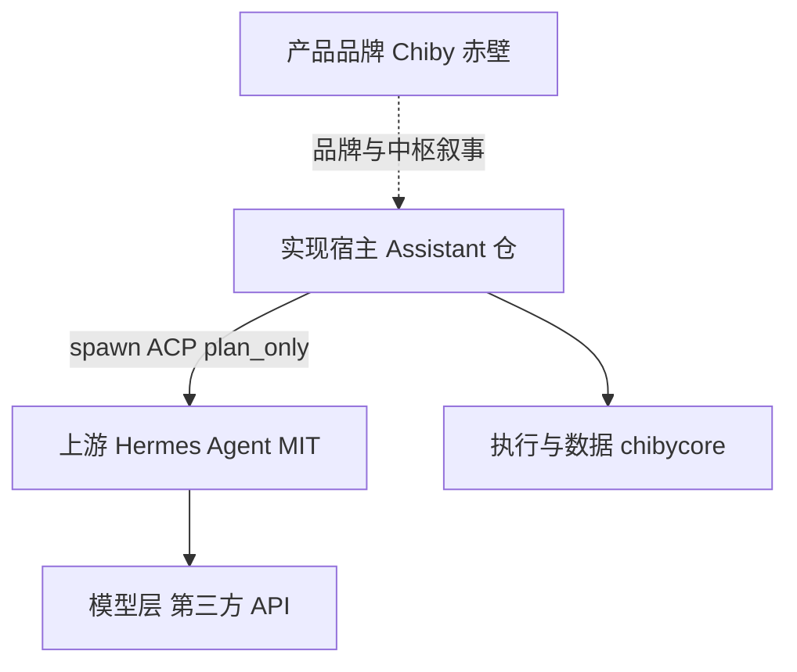
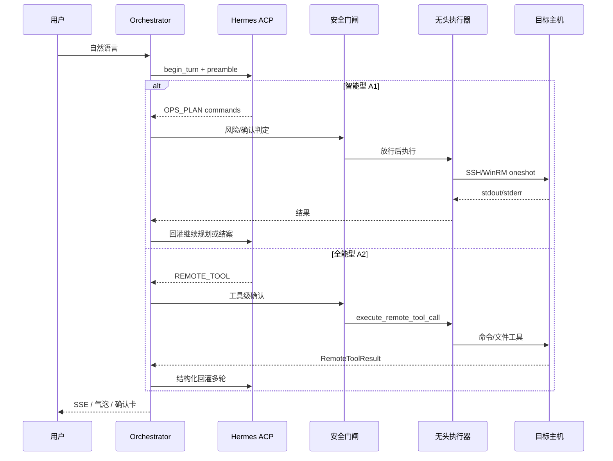

# Chiby（赤壁）技术白皮书

| 项 | 内容 |
|----|------|
| 产品品牌 | **Chiby（赤壁）** — 运维智能中枢 |
| 文档版本 | v1.0 |
| 日期 | 2026-07-25 |
| 状态 | 与现网单体仓 `Assistant` 对齐；产品切仓（ops-bridge / Pro / SaaS）为定稿草案 |
| 关联 | [system-code-structure.md](./system-code-structure.md) · [oss-pro-saas-architecture.md](./oss-pro-saas-architecture.md) · [knowledge-hub-user-manual.md](./knowledge-hub-user-manual.md) · ADR-0003 / ADR-0004 · [tsm-a-security-model.md](./tsm-a-security-model.md) |

---

## 0. 一句话定位

> **Chiby（赤壁）** 是面向多主机运维的 AI Agent **产品**；技术上基于上游 **Hermes Agent（MIT）** 做规划与推理运行时，由 **Assistant** 宿主完成连主机、确认、无头执行与审计。  
> **Hermes 负责「想」；Chiby / Assistant 负责「敢不敢做、怎么做、做完如何追溯」。**

---

## 1. 总体架构（开篇总图）

### 1.1 产品逻辑架构

下列总图应作为阅读本白皮书的**第一心智模型**：入口 → 中枢/规划 → 安全门闸 → 执行平面 → 数据与审计。



### 1.2 现网进程与协议拓扑



### 1.3 产品三层切分（目标架构 · 草案）

```text
用户入口
  终端 CLI ──┐
  终端 Web UI ├──► 逻辑通道：开源版 / Pro / 掌上 SaaS
  掌上 App/IM ┘

┌─ 终端开源 ops-bridge ──────┐    ┌─ 终端 Pro assistant-pro ──────────┐
│ TSM-A 护栏 · 最小执行器     │◄──│ Chiby 中枢 · 全量工具 · 连接池     │
│ 指令型 + 弱化分析型 · Demo │    │ C++ pro_core（门闸+许可+专利）    │
└────────────────────────────┘    └───────────────────────────────────┘

┌─ 掌上 SaaS（独立仓 · 完全闭源）────────────────────────────────────┐
│ 移动后端 · IM · 多机 Job · 企业策略 · 计费 · 云端中枢               │
│ 凭据经堡垒/临时通道，SaaS 不落盘明文                                 │
└────────────────────────────────────────────────────────────────────┘
```

> **现网状态**：仍为 **Assistant 单体仓**（`terminal/` + `chibycore/` + `data/`）。切仓未执行；白皮书同时描述「正在跑的」与「产品定稿的」。

### 1.4 品牌与依赖关系



| 名称 | 角色 | 开源？ |
|------|------|--------|
| **Chiby（赤壁）** | 产品品牌与商业中枢叙事 | 品牌与中枢逻辑商业闭源 |
| **Hermes Agent** | 上游 Agent 运行时（Nous Research） | **MIT**（须保留声明） |
| **Assistant** | 现网单体实现仓 | 拟拆为开源护栏 + Pro |
| **模型层** | LLM 权重 / API | 采购或自建，≠产品开源义务 |

**对外口径**：产品叫 Chiby；基于 Hermes Agent（MIT）构建；技术标识可保留 `hermes_*`（桥、WS、YAML），**不是给 Hermes 改名**。

---

## 2. 设计原则

1. **规划与执行分离**：模型/Agent 不拿主机密码；凭据只在 Assistant / chibycore 侧按 `host_id` 解析。  
2. **默认 plan_only**：Hermes 默认禁止本机 terminal；远端动作经契约块或 REMOTE_TOOL 交回宿主。  
3. **安全先于自动化**：TSM-A 分层；只读可自动，变更/写文件/高危须确认卡（模式可放宽但仍有气囊）。  
4. **模式强制通道**：高效/智能 → A1；全能 → A2；yaml 全局开关不能悄悄改模式行为。  
5. **可审计可复盘**：`turn_id` / `trace_id`、JSONL、聊天审计、主机快照、取证包。  
6. **知识按需召回**：KnowledgeHub 工具化读写，不把整库塞进 prompt，不与主机「内存」语义混淆。

---

## 3. 运行时主链路

### 3.1 掌上 IM（产品主演示链）

```text
mobile_im_demo.html
  → POST /api/mobile/demo/message/stream  (SSE)
  → MobileSessionOrchestrator
       ├─ efficient   → planner_m0（规则）→ 确认? → headless_exec
       ├─ intelligent → Hermes ACP → OPS_PLAN/JOB → A1 闭环 → 确认 → 执行 → 文本回灌
       └─ omnipotent  → Hermes ACP → REMOTE_TOOL → A2 闭环 → 确认卡 → 执行 → 结构化回灌
  → audit / transcript / host_snapshot / chat_audit
  → SSE 事件推前端
```

### 3.2 终端 Web + Chiby Tab

```text
index.html / ops-ui
  ├─ /ws/terminal/{session_id}  → 交互式 PTY（SSH/WinRM）
  └─ /ws/hermes                 → acp_session ↔ hermes acp
       · 流式回复、权限弹窗、delegate 进度 note
       · 与左侧会话并行；NL「知识库」模式旁路检索不进 Agent 计划链
```

### 3.3 A1 / A2 通道（ADR-0003）

| 通道 | 契约形态 | Hermes 职责 | Assistant 职责 |
|------|----------|-------------|----------------|
| **A1** | `<<<OPS_PLAN>>>` / `<<<OPS_JOB>>>` | 只规划命令 | 解析 → ACL/确认 → 无头执行 → **文本回灌** |
| **A2** | `<<<REMOTE_TOOL>>>` JSON | 选工具 + 参数（仅 host_id） | 同一套门闸与执行 → **结构化回灌** |



---

## 4. 三模式分层（ADR-0004）

| 模式 ID | 中文 | Planner | 通道 | remote_tools | 确认策略 | 闭环 |
|---------|------|---------|------|--------------|----------|------|
| `efficient` | 高效型 | 规则 `planner_m0` | A1 | 关 | 高危必确认；只读可直跑 | 无 Hermes 多轮 |
| `intelligent` | 智能型 | Hermes | A1 OPS | **关** | 变更确认 + 检查点 | `_run_advanced_closure` |
| `omnipotent` | 全能型 | Hermes | A2 REMOTE_TOOL | **开** | 仅高危；常规变更可自动 | `_run_a2_closed_loop`（轮次上限） |

兼容旧名：`ops`→efficient，`advanced`→intelligent，`code`→挂接智能型表面。

**强制映射（会话模式优先于 yaml）：**

```text
efficient  → remote_tools=false → A1 only（rules）
intelligent→ remote_tools=false → A1 OPS 闭环
omnipotent → remote_tools=true  → A2 单脑（忽略误发的 OPS_*）
```

---

## 5. 子系统详解

### 5.1 编排器（`terminal/mobile/orchestrator.py`）

掌上会话状态机中心：绑定主机、模式策略、斜杠命令拦截、A1/A2 完成、确认卡挂起、熔断、回灌、审计落盘。几乎所有「产品行为」最终汇聚于此。

### 5.2 Hermes 桥（`terminal/hermes_bridge/`）

| 模块 | 作用 |
|------|------|
| `config.py` | `data/hermes_bridge.yaml` |
| `spawn.py` | 启动 `hermes acp`（支持 `uv run`） |
| `acp_worker.py` | 掌上无 WS Worker + preamble |
| `acp_session.py` | 终端 Tab：stdio ACP ↔ WebSocket |
| `native_workspace.py` | 本机白名单编程（与掌上远端正交） |

配置要点：`execution_mode: headless_proxy`、`plan_only`、`hermes_home_mode`（`inherit` / `assistant_managed`）、`mobile_demo.executor: fake|real`。

### 5.3 远端工具面 A2（`remote_tools.py`）

白名单工具包括：`host_list`、`ssh_execute` / `winrm_*`、文件读写/备份/日志、以及本地 **`kb_search` / `kb_get` / `kb_ingest`**。  
本地知识库工具无 `host`，对齐 `host_list` 短路模式；`kb_ingest` 始终确认卡，且仅智能型/全能型可写。

### 5.4 无头执行（`headless_exec` → chibycore）

- **oneshot**：connect → run → close（非聊天级长连接）  
- 支持 fake 罐头输出（演示）与 real 凭据执行  
- 与交互式 `/ws/terminal` PTY **分离**

### 5.5 知识库 KnowledgeHub

- 存储：`data/knowledge_hub.db`  
- API：`/api/kb`  
- 管理页：`/demo/knowledge-hub`  
- Agent：工具化检索/写入（详见 [knowledge-hub-user-manual.md](./knowledge-hub-user-manual.md)）  
- **≠** Hermes `MEMORY.md`

### 5.6 闭环与自愈

- 终端 NL 修复时间线、`closure-execute`  
- 掌上 A1/A2 回灌闭环  
- 成功经验可沉淀至知识库 / `kb_closure_archive`  
- 设计见 `docs/命令修复闭环（自动修复阶段）设计.md`、`closure-api.md`

### 5.7 主机与 ACL

- `data/hosts.json`（可选加密）  
- 掌上 ACL：`mobile_demo_acl` 控制可见主机  
- 发行版探测、`host_snapshot` 跨会话焦点

### 5.8 审计与 TSM-A

| 层 | 强度 | 手段 |
|----|------|------|
| L1 | 软 | 确认卡、AI 解读、高危二次确认 |
| L2 | 硬 | 凭据保险箱、OTP、ExecTicket 短票（底座/规划中增强） |
| L3 | 取证 | JSONL、`trace_id`/`turn_id`、timeline、forensic、SIEM 钩子 |

页面：`/demo/mobile-audit`；聊天完整正文：`data/mobile_chat_audit/`。

---

## 6. 现网代码地图

```text
Assistant/
├── terminal/                 # FastAPI：UI、掌上、Hermes 桥
│   ├── main.py               # 主应用入口
│   ├── mobile/               # 掌上编排核心
│   ├── hermes_bridge/        # ACP 桥
│   └── web/                  # 静态页（终端 / IM / 知识库 / 审计…）
├── chibycore/                 # 执行、策略、闭环、知识库、脱敏
├── data/                     # 运行时配置与落盘
├── docs/                     # 本白皮书与 ADR / 手册
├── ops-ui/                   # Vite 前端（Chiby 聊天面板）
├── remediator/ · api/        # 修复提案 / 较旧 API
├── patches/hermes-assistant-overlay/
├── tests/ · deploy/
└── requirements.txt · README.md
```

**推荐启动：**

```bash
uvicorn terminal.main:app --host 127.0.0.1 --port 8000
```

健康检查：`GET /api/health`。

---

## 7. 数据面与配置

| 路径 | 说明 |
|------|------|
| `data/hosts.json` | 主机与凭据 |
| `data/hermes_bridge.yaml` | 桥 / 掌上 / remote_tools 白名单 |
| `data/hermes_profiles/tab_*/` | 隔离 HERMES_HOME |
| `data/knowledge_hub.db` | 知识库 |
| `data/ops.db` | 策略/变更等 |
| `data/mobile_audit.jsonl` | 掌上审计 |
| `data/mobile_chat_audit/` | 完整聊天审计 |
| `data/mobile_sessions/` · `mobile_transcripts/` | 会话与对话 |
| `data/host_snapshots/` | 主机快照 |
| `data/llm_config.json` | LLM 配置 |
| `.env` | 密钥与环境变量 |

---

## 8. 主要页面与 API 面

### 8.1 页面

| URL | 功能 |
|-----|------|
| `/` · `/terminal` | 主终端 + 主机管理 + NL |
| `/demo/mobile-im` | 掌上 IM（三模式、确认卡、SSE） |
| `/demo/mobile-jobs` | 多机 Job |
| `/demo/mobile-audit` | 审计大屏 |
| `/demo/knowledge-hub` | 知识库 CRUD |
| `/demo/hermes-lab` | Skills / MCP / Memory 轻量面板 |
| `/docs` | OpenAPI（含 KnowledgeHub） |

### 8.2 掌上 API（摘要）

| 方法 | 路径 | 作用 |
|------|------|------|
| POST | `/api/mobile/demo/message/stream` | 发消息 SSE |
| POST | `/api/mobile/demo/permission/stream` | 确认卡 |
| POST | `/api/mobile/demo/agent-mode` | 切模式 |
| POST | `/api/mobile/demo/targets` | 选主机 |
| POST | `/api/mobile/demo/cancel` | 取消 |
| GET | `/api/mobile/demo/audit` · `timeline` · `forensic` · `status` | 审计与状态 |

### 8.3 知识库 API

前缀 `/api/kb`：stats / search / kb CRUD / scripts / best-practices / ingest / export。

---

## 9. 安全模型摘要

1. **凭据永不进入工具参数与 Hermes 上下文**（仅 `host_id`）。  
2. **确认卡**是变更默认路径；全能型放宽常规变更但仍拦截毁灭性操作。  
3. **斜杠命令**产品层拦截（如 `/reset`），避免 preamble 拼装后 ACP 误识别。  
4. **脱敏**：回灌与用户折叠条经 redaction。  
5. **开源边界**：护栏与 Demo 可开源；中枢、许可、专利、掌上 SaaS、生产知识库运营能力属 Pro（见 [open-source-boundary-review.md](./open-source-boundary-review.md)）。

---

## 10. 开源 / Pro / SaaS 边界（产品定稿）

| 开源（规划 ops-bridge） | 闭源 Pro / SaaS |
|------------------------|-----------------|
| TSM-A L1 确认卡与基础审计 | Chiby 中枢、`pro_core`、许可、专利 |
| 指令型 + 弱化分析 | 现网级智能型/全能型闭环 |
| 最小 SSH/WinRM + 只读工具子集 | 全量写工具、连接池、堡垒机 |
| 自洽 Demo | 掌上 SaaS、IM、计费、企业策略 |
| 知识库「能力叙事」受限 | 生产 KnowledgeHub 与追因库 |

**硬约束**：开源不 import 闭源；Pro 可 pip 依赖开源；掌上 SaaS 不要求客户机安装 ops-bridge。

---

## 11. 典型使用场景（与架构的对应）

| 场景 | 入口 | 架构路径 |
|------|------|----------|
| 快速查磁盘/内存 | 掌上高效型 | rules → A1 → oneshot |
| 复杂排障多轮 | 智能型 | Hermes → OPS → 回灌闭环 |
| 远端改文件/多步工具 | 全能型 | REMOTE_TOOL → A2 闭环 |
| 按手册处理故障 | 任意 Hermes 模式 + KB | `kb_search` → 再执行 |
| 维护手册 | `/demo/knowledge-hub` | REST CRUD → 同一 SQLite |
| 交互式登主机 | 终端 Web | `/ws/terminal` PTY |
| 桌面旁路搜库 | 终端 NL「知识库」 | 不进 Agent 计划链 |
| 多主机巡检 | 掌上 IM 多选主机 | 每主机独立协程通道 + 聊天 HostTabs + Hermes 总览 |

---

## 12. 技术栈摘要

| 层 | 技术 |
|----|------|
| 后端 | Python · FastAPI · uvicorn · asyncio |
| Agent 桥 | Hermes ACP（stdio JSON-RPC） |
| 执行 | paramiko / WinRM · oneshot |
| 存储 | SQLite · JSON/JSONL · YAML |
| 前端 | 静态 HTML/JS · xterm · ops-ui（Vite/React） |
| 测试 | pytest |

---

## 13. 演进路线（摘要）

| 阶段 | 目标 |
|------|------|
| **现网** | 单体 Assistant：终端 + 掌上 Demo + Hermes 桥 + 知识库工具化 |
| **P0** | 抽出 `packages/ops_bridge` 执行护栏；理清开源/闭源依赖方向 |
| **Pro** | `pro_core` 门闸与许可；连接池；生产知识库/追因 |
| **SaaS** | 掌上独立仓；IM 原生；租户与计费；凭据不落盘 |

---

## 14. 文档索引（深入阅读）

| 主题 | 文档 |
|------|------|
| 现行代码结构 | [system-code-structure.md](./system-code-structure.md) |
| 开源/Pro/SaaS | [oss-pro-saas-architecture.md](./oss-pro-saas-architecture.md) |
| 切分评审 | [open-source-boundary-review.md](./open-source-boundary-review.md) |
| 模式分层 | [adr/0004-mode-hierarchy.md](./adr/0004-mode-hierarchy.md) |
| A1/A2 | [adr/0003-remote-tools-and-ops-coexistence.md](./adr/0003-remote-tools-and-ops-coexistence.md) |
| 安全模型 | [tsm-a-security-model.md](./tsm-a-security-model.md) |
| 知识库手册 | [knowledge-hub-user-manual.md](./knowledge-hub-user-manual.md) |
| 掌上操作 | [mobile-ai-datacenter-ops-manual.md](./mobile-ai-datacenter-ops-manual.md) |
| 启动与桥 | [../README.md](../README.md) |

---

## 15. 结语

Chiby 的差异化不在「再做一个聊天框」，而在：

1. **运维级执行平面**（多主机、oneshot、确认卡、审计）与 Agent 规划的严格分权；  
2. **模式化通道**（高效规则 / 智能契约 / 全能工具）同一套安全底座；  
3. **可运营的本地知识库**与闭环沉淀，使经验可复用而非一次性对话；  
4. 清晰的 **开源护栏 vs 商业中枢** 边界，合规使用上游 Hermes，而不宣称独占。

架构总图见 **§1**；落地细节以本仓 `terminal/` + `chibycore/` 与上述关联文档为准。
