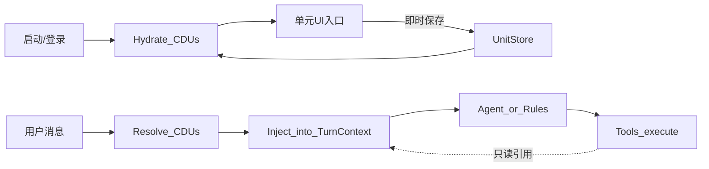

# 上下文数据单元（CDU）架构

> 状态：**首版落地**（平台骨架 + HostTargets 样板）  
> 目标：通用 AI 助手允许每个助手声明专属「数据单元」——UI 入口、本地/服务端存储、启动恢复、执行前注入。  
> **主机选择不是工具**，而是工具执行前注入的上下文数据单元。

相关：[tool-plugin-delivery-handbook.md](./tool-plugin-delivery-handbook.md) · [extending-agent-tools.md](./extending-agent-tools.md)

---

## 1. 结论

| 概念 | 是什么 | 不是什么 |
|------|--------|----------|
| **工具（Tool）** | Agent 可调用的能力入口（`tools/plugins/*`） | 「当前选中谁」的权威来源 |
| **上下文数据单元（CDU）** | 调用链独立阶段：Hydrate → Resolve → Inject | 不进白名单、不发 `REMOTE_TOOL` |
| **可见主机目录** | ACL 下可被列出的主机集合（`host_list` / jobs hosts） | 当前选中态 |



---

## 2. CDU 声明

| 字段 | 说明 |
|------|------|
| `unit_id` | 如 `host_targets` |
| `assistant_id` | 作用域；首版 `chiby_mobile` |
| `title` / `description` | 文档与市场展示 |
| `ui_slot` | 如 `chrome_top_left`（嵌入对话壳，非独立配置页） |
| `storage` | `local` \| `server` \| `both`（HostTargets = **both**） |
| `user_scoped` | 有 `external_user_id` 时按用户分桶；否则 `anon` |
| `scope` | 首版固定 **`user`**（跨会话共享）；见 §3.2 |
| `required_for_tools` | 依赖本单元的工具类型提示（如 `host_*`） |

---

## 3. 存储键与权威源

```text
client: localStorage[`cdu:{assistant}:{user}:{unit}`]
server: data/context_units/{assistant}/{user}/{unit}.json
```

- UI 变更：先写 client → 立即 `PUT` 服务端。
- **每条消息可带 `ui_host_ids`**：有则**本回合优先于 CDU hydrate**（修复「顶栏已选 yl、气泡也写了 yl，但编排仍用旧 main」）。
- **切机清 ACP**：绑定主机变化时 flush / 重建 advanced Worker，并标 `session_rebuilt`；执行面单选时若工具仍带历史 host，按顶栏选机纠正（防首轮粘滞到旧机）。
- **顶栏先 PUT 再发消息**：选机 API 已改绑定后，本回合 `prev==cur`，靠 `last_hermes_host_id` / `host_switch_pending` 仍触发清续接 + flush，禁止用旧机 `last_offer` 顶替作答。
- **切机「作废」强提示**：注入 `⚠️ 工作台已切换` 块，明示丢弃了哪些旧机结论（内存/进程/磁盘等），要求对本机重查。
- **Snapshot 空数据显式标记**：`memory_available` / `disk_available` / `data_available`；无快照也注入 false，禁止用其他主机填空。
- **续接锚点归属**：`continuity_host_id`；与当前机不符时丢弃 `last_offer`/`diag_focus` 回灌。
- **P0 执行面硬拦截**：Agent 显式 `host` 越出顶栏选中集时返回 `host_selection_violation`（默认开启；`OPS_HOST_SELECTION_STRICT=0` 可降级为纠回）。空 host 仍由选机/默认注入。
- **P0 Turn Trace**：`data/turn_traces/{turn_id}.jsonl`；事件含 `user_intent` / `host_switch` / `tool_call` / 审计 fan-out；查询 `GET /api/mobile/demo/turn-trace?turn_id=`。
- 启动：client hydrate；有登录用户时以 **server 覆盖冲突字段**（换设备可恢复）；随后仍以消息携带的选机为准。
- 会话 `mobile_sessions` 仍可镜像 `ui_host_ids`（兼容 / 本回合加速），**权威源是 UnitStore**（无消息覆盖时）。
- **不落凭据**；HostTargets 仅 `host_ids[]`（及可选展示缓存）。
- 选机可用 **id / name / 连接地址** 别名，写入前归一成 `host_id`。

### 3.1 用户分桶与角色（定稿）

| 问题 | 定稿 |
|------|------|
| 分桶键 | **`external_user_id`**；空 → `anon` |
| 同一自然人多角色？ | **首版不在 CDU 键上叠 `role` / `scope`** |
| 多角色怎么做？ | 若同一人需不同 ACL/选机画像，使用**不同的 `external_user_id`**（ACL 用户即身份） |
| 何时再加 role？ | 出现「同一登录账号、多角色切换且共享登录态」的产品需求时，再扩展键为 `user` + `role`（或 `persona_id`）；**当前不必** |

理由：掌上演示与现网 ACL 已以 `external_user_id` 为授权主语；CDU 与 ACL 对齐，避免双重身份模型。

### 3.2 用户级 vs 会话级（定稿）

**HostTargets 默认是用户级（user-scoped），不是会话级。**

| 行为 | 说明 |
|------|------|
| 同用户、不同 `conversation_id` | **共享**同一份 `host_ids`（换会话 / 刷新 / 换端仍是「我的当前目标机」） |
| 存储键是否含 `session_id` | **不含**（有意为之） |
| 会话 JSON 里的 `ui_host_ids` | 仅镜像；冲突时以 UnitStore 为准 |

产品类比：聊天应用顶栏的「当前工作上下文」——跟的是**人**，不是每一个线程副本。

若将来某助手需要「每会话不同选机」：

1. 在该单元 `ContextUnitSpec` 上设 `scope: conversation`；
2. 键增加 `conversation_id` 段；
3. **不得**默默改 HostTargets 的 user 语义（避免运维习惯被打碎）。

---

## 4. HostTargets 样板

### Schema（值）

```json
{
  "host_ids": ["main.sunsi.cn"],
  "bound_host_id": "main.sunsi.cn",
  "updated_at": 1720000000.0
}
```

### Resolve 规则

1. 输入候选 `host_ids`（UI / store / 会话镜像）。
2. ACL 过滤 + 可见主机表过滤。
3. `bound_host_id`（兼容字段）= 首台 accepted（多机时取首台作单机路径回退）。
4. 空选：见 §4.1（**允许为空**；不静默填满 ACL）。

### 4.1 空选策略（定稿）

当 Resolve 后 `host_ids == []`：

| 场景 | 行为 |
|------|------|
| 本地只读工具（`host_required: false`） | 正常执行（如 `kb_search`、`example_echo`、`host_list` 目录发现） |
| 依赖主机的规则意图 / `host_*` 工具且未显式带 `host` | **拒绝执行**，返回 **`need_host`**：提示用户在顶栏（CDU UI）勾选主机；**不**自动挑选 ACL 中的「第一台」或「全部」 |
| Agent 在 JSON 里显式写了 `host` | 仍走 ACL；与 CDU 空选无关（显式参数优先） |
| ACL `auto_pick_single_host` 且可见目录**恰好 1 台**且尚无 bound | **唯一例外**：可自动绑定该台（现网便利开关）。多机目录下**禁止**借此填 CDU |

禁止的不一致实现：

- 空选时静默 `hosts[0]`；
- 空选时扇出到全部可见主机；
- 用 `host_list` 工具结果写回 HostTargets。

### 与 `host_list` 边界

| | HostTargets（CDU） | host_list（工具） |
|--|-------------------|-------------------|
| 职责 | 当前选中谁 | 列出 ACL 可见目录 |
| 会改选中态？ | 是（仅 UI/API） | **否** |
| Agent 调用 | 不作为选机手段 | 可选发现 |

---

## 5. 与工具插件边界

- Manifest **禁止**把「当前选中主机」做成独立选机逻辑。
- `host` 参数：Agent 可显式传；缺省由 Inject 从 `host_targets` 填充。
- 工具 context 可读 `units["host_targets"]`，不得反向写入选中态。

---

## 6. UI 入口（嵌入对话壳）

CDU UI 是**轻量、嵌在对话界面 chrome 里的单元槽**，不是独立配置页。用户应能在对话中随手改，如同调整「当前会话上下文」。

| 能力 | 描述 | HostTargets 落点（首版） |
|------|------|--------------------------|
| **状态展示** | 一眼看到单元当前值 | 顶栏：「已选择 N 台」/ 单机名 + 详情 |
| **实时调整** | 增删改单元内容 | 顶栏左主机弹层勾选 / 多选 |
| **即时保存** | 调整后自动持久化，无「保存」按钮 | `localStorage` + `PUT /api/context-units/host_targets` |
| **历史数据** | 登录用户恢复上次单元 | 启动 hydrate：local → GET；**server 覆盖冲突** |

约束：

- `ui_slot: chrome_top_left`（可扩展侧栏槽，仍属对话壳）；
- 不强制跳转 `/settings`；
- 文案口径：**选机是上下文，不是工具**。

---

## 7. API

| 方法 | 路径 | 说明 |
|------|------|------|
| GET | `/api/context-units` | 已注册单元 + 现值 |
| GET/PUT | `/api/context-units/host_targets` | 读写选机 |
| POST | `/api/mobile/demo/targets` | **兼容转发** → HostTargets |

Query/body 需带 `assistant_id`（默认 `chiby_mobile`）、`external_user_id`、`conversation_id`（可选，用于镜像会话态；**不改变用户级权威键**）。

---

## 8. 代码索引

| 路径 | 职责 |
|------|------|
| `terminal/context_units/` | 类型、注册表、UnitStore、HostTargets |
| `terminal/mobile/orchestrator.py` | Resolve/Inject；`set_ui_targets` 写单元 |
| `terminal/mobile/api.py` | 通用 CDU API + targets 转发 |
| `terminal/web/mobile_im_demo.html` | `cdu:…` 键、启动 hydrate、顶栏槽 |

---

## 9. 后续扩展位（非本轮）

| unit_id | 用途 |
|---------|------|
| `kb_workspace` | 知识库工作区 / 默认 mode |
| `doc_corpus` | DocHub 语料子集 |
| `diag_focus` | 诊断焦点日志路径（可从会话字段迁出） |

可选演进：`scope: conversation`、键上 `role`/`persona_id`（仅当产品出现对应登录模型）。

---

## 10. 迁移勾选

- [x] 架构文档
- [x] UnitStore + HostTargets Resolve
- [x] 编排注入 / `set_ui_targets` 双写
- [x] API + IM UI 存储键
- [x] 回归测试
- [x] 用户级共享 / 空选 / UI 槽 定稿说明（本文 §3–§6）
- [ ] 删除会话内 `bound_host_id` 唯一来源（下阶段）
