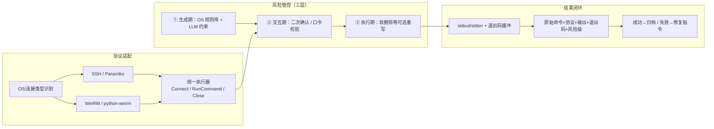

# ChibyTerm（赤壁终端）— Web 终端 + 自然语言运维平台

## 一、背景与目标

**现有系统：** `ai-ops-assistant` 已具备完整的自然语言 → 任务链 → SSH 执行链路，但交互方式是「表单提交 → 后台执行 → 结果展示」，是**离线批处理模式**，没有实时终端体验。

**改造目标：** 在保留现有任务链能力的同时，新增**实时交互式终端**，让用户像用 SSH 一样操作多台主机，但输入可以是自然语言，LLM 负责理解和翻译。

---

## 二、系统架构

```
┌─────────────────────────────────────────────────────────────────┐
│                        浏览器 (Web UI)                          │
│   ┌──────────────┐   ┌──────────────┐   ┌──────────────────┐  │
│   │  xterm.js    │   │  会话管理面板  │   │  自然语言输入区   │  │
│   │  (终端渲染)   │   │  (多主机Tab)  │   │  (AI 命令行)     │  │
│   └──────┬───────┘   └──────┬───────┘   └────────┬─────────┘  │
└──────────┼───────────────────┼────────────────────┼────────────┘
           │ WebSocket          │ HTTP/REST          │ HTTP/REST
           │ (ptty 隧道)         │                    │
           ▼                    ▼                    ▼
┌─────────────────────────────────────────────────────────────────┐
│                      FastAPI 后端 (ASGI)                        │
│  ┌────────────────┐  ┌──────────────┐  ┌───────────────────┐   │
│  │ WebSocket 终端  │  │  会话管理器    │  │  LLM 路由层       │   │
│  │ /ws/terminal   │  │  SessionMgr  │  │  /api/v1/chat    │   │
│  │  (ptty/paramiko)│  │  (多主机并发) │  │  (自然语言解析)   │   │
│  └───────┬────────┘  └──────┬───────┘  └────────┬──────────┘   │
│          │                  │                    │              │
│          ▼                  │                    │              │
│  ┌────────────────────────────────────────────────────────────┐ │
│  │               核心能力层 (chibycore)                        │ │
│  │  ssh_executor │ chains │ parser │ script_generator │ llm  │ │
│  └────────────────────────────────────────────────────────────┘ │
└─────────────────────────────────────────────────────────────────┘
```

---

## 三、核心模块设计

### 3.1 Web 终端层 (WebSocket PTY)

**技术选型：**
- 前端：`xterm.js` + `xterm-addon-fit` + `xterm-addon-webgl`
- 后端：`python-ptymanager` 或 自实现 `asyncio` + `paramiko`

**设计思路：**

现有的 `exec_ssh()` 是一次性 SSH 会话（执行一条命令就关闭）。新设计需要**持久化 PTY 会话**：

```
WebSocket /ws/terminal/{session_id}
    ├── 接收浏览器键盘输入 → 写入 paramiko SSH shell channel
    ├── 接收 paramiko 输出 → 推送给浏览器 xterm
    └── 心跳保活 + 窗口 resize 事件
```

**新增文件：** `api/terminal_ws.py`

```python
# 核心类：TerminalSession
class TerminalSession:
    session_id: str
    host: str
    ssh_user: str
    ssh_client: paramiko.SSHClient  # 持久连接
    channel: Channel               # PTY shell 通道
    ws: WebSocket                  # 浏览器连接
    created_at: datetime
    last_active: datetime
    auth_type: AuthType            # PASSWORD | PRIVATE_KEY
```

**认证方式（Phase 1 只做密码）：**
- 用户在 Web UI 输入 `用户名@主机:端口` + 密码
- 后端建立 SSH 连接，保存 session（不关闭）
- 支持同时维护多个活跃 session（每台主机一个）

**窗口 resize 支持：**
- xterm.js 发送 `SIGWINCH` 事件 → paramiko channel resize
- 确保 `top`、`vim` 等交互式程序正常显示

**回滚策略：**
- 连接超时 10s，认证失败 3 次自动断开
- 空闲 30min 自动关闭 session

### 3.1.1 WebSocket：计划步骤确认与「本步重试」弹窗

**客户端 → 服务端 `step_ok`（节选）：**

| 字段 | 说明 |
|------|------|
| `verdict` | `continue` / `retry` / `abort` |
| `retry_kind` | 仅 `verdict=retry` 时建议必传：`ai`（合并说明后由 LLM 重算本步命令，说明可空则走后端默认提示）、`repeat`（不调 LLM，原命令再执行）。未传时兼容旧逻辑：有 `retry_user_note` 视为 `ai`，否则视为 `repeat`。 |
| `retry_user_note` | 可选；`retry_kind=ai` 时为用户补充说明（可空）。 |

**重试后若本步为危险命令：** 服务端将 `phase` 置为 `awaiting_danger_confirm` 并下发 `plan_danger`，与首次执行该步的危险闸门一致，需用户再次确认后才执行。

**远端 oneshot 镜像（可选）：** 环境变量 `OPS_PLAN_STEP_USE_CLOSURE=1`（或兼容名 `OPS_PLAN_RETRY_USE_CLOSURE=1`）且会话已绑定 `host_id`、主机在 `hosts` 存储中存在时，计划步骤下发（含正常派发、危险确认后执行、重试执行）可走 **oneshot + 网关 + `run_closure_retry_loop(max_fix_attempts=0)`**，输出经 `mirror_payload_to_session` 写入会话 `output_capture`；未满足条件时仍走 PTY `shell_input`。

**服务端 → 客户端：** `plan_retry_notice` 携带 `refined`、`message`、`command_preview`，供右侧聊天提示。

### 3.2 自然语言 → 命令翻译层

**交互模式：** 在终端内输入自然语言指令，由 LLM 翻译成 shell 命令后执行。

**前缀约定：**
```
ai> 帮我查看磁盘使用情况
ai> 在所有主机上执行 uptime
ai> 部署 nginx 到当前主机
```

**路由逻辑：**

```
用户输入
  │
  ├─ 以 ai> 开头 → LLM 自然语言路由
  │      │
  │      ├─ 匹配 TASK_CHAINS → 执行任务链（保持现有能力）
  │      ├─ 简单命令翻译 → echo "自然语言描述" | translate → 执行
  │      └─ 解释性请求 → 直接返回 LLM 分析结果（不回显到终端执行）
  │
  └─ 普通 shell 命令 → 透传给 SSH PTY 执行
```

**新增文件：** `chibycore/ai_shell.py`

```python
class AIShellRouter:
    """终端内的 AI 命令路由器"""

    def route(user_input: str, session_context: SessionContext) -> RouterResult:
        # 1. 解析前缀
        # 2. 调用 llm_orchestrator 理解意图
        # 3. 返回执行计划或直接命令
```

**LLM Prompt 设计：**

```
你是一个运维命令翻译器。用户用自然语言描述操作，你将其翻译为精确的 shell 命令。
当前主机信息: {hostname}, {os_type}, {shell_type}

规则：
- 只返回命令本身，不加解释
- 多条命令用 && 连接
- 危险操作（rm -rf / 等）拒绝翻译并返回警告
- 如果是问询类（"帮我分析..."、"告诉我..."），直接返回分析结果，不执行命令
```

### 3.3 多会话并发管理

**设计目标：** 同时管理多台主机的 SSH 会话，类似 `tmux` 或 `tmux-cssh`。

**Session Manager：**

```python
class SessionManager:
    """全局会话管理器"""

    def __init__(self):
        self.sessions: Dict[str, TerminalSession] = {}

    async def create_session(
        self,
        session_id: str,
        host: str,
        port: int,
        username: str,
        password: str,          # Phase 1
        # private_key: str = None,  # Phase 2
    ) -> TerminalSession:
        ...

    async def send_input(session_id: str, data: bytes):
        ...

    def get_active_sessions() -> List[SessionInfo]:
        ...

    async def close_session(session_id: str):
        ...

    async def broadcast_to_group(group_id: str, data: bytes):
        """批量命令：同时向一组主机发送相同命令"""
        ...
```

**主机分组：**

当前实现（API）：使用主机 **`tags`** 表达分组（例如 `web-servers`），与「添加主机」时的标签一致；`POST /api/intent-broadcast/preview|dispatch` 传入 `tag` 即选中该组全部主机，可与 `host_ids` **并集**。先做 **静态冲突检测**（SSH/WinRM 混部、systemd/SysV 标签不一致、NL 中含 systemd/apt 与 Windows 段并存等），再按 **异构分段**（`ssh_linux_systemd` / `ssh_linux_sysv` / `winrm_powershell`）分别做 NL→命令翻译并 **并行 oneshot 下发**，响应中按段聚合「同源意图、异构适配」。可选主机标签：`init:systemd`、`init:sysv`、`distro:debian`、`distro:rhel` 等以增强检测精度。

```
# 用户定义分组（存储在 DB 或配置文件）
[web-servers]  →  192.168.1.10, 192.168.1.11, 192.168.1.12
[db-servers]   →  192.168.1.20, 192.168.1.21
[all]          →  [web-servers] + [db-servers]
```

**批量执行：** 输入 `@web-servers> 帮我重启 nginx`，自动向该组所有主机建立连接并发执行。

### 3.4 Web UI 设计

**页面结构（单页应用）：**

```
┌─────────────────────────────────────────────────────────────┐
│  🤖 ChibyTerm    [+ 新建会话]  [🗂️ 会话列表]  [⚙️ 设置]   │ ← 顶部工具栏
├────────────┬────────────────────────────────────────────────┤
│            │  ┌─ Tab: 192.168.1.10 ─┬─ Tab: 192.168.1.20 ─┐ │
│  主机列表   │  │                      │                     │ │
│            │  │  xterm.js 终端区域    │  xterm.js 终端区域  │ │
│  ├─ 生产环境│  │                      │                     │ │
│  │ ├─ web1 │  │  user@web1:~$ ai>    │  user@db1:~$ ai>    │ │
│  │ ├─ web2 │  │  帮我查看资源         │  帮我部署 redis     │ │
│  │ └─ db1  │  │  🔄 AI 正在翻译...    │  [执行任务链...]     │ │
│  ├─ 测试环境│  │  $ df -h             │  $ apt install...  │ │
│  └─ ...    │  │  Filesystem  Size... │  ...               │ │
│            │  └──────────────────────┴─────────────────────┘ │
│  [+ 添加主机] │                                               │
├────────────┴────────────────────────────────────────────────┤
│  💬 自然语言交互区（可选，侧边栏收起）                          │ ← 底部面板
│  输入: [帮我检查 web1 的磁盘使用情况，并检查 nginx 状态        ] │
│  [发送] [清空] [历史]                                          │
└─────────────────────────────────────────────────────────────┘
```

**组件选型：**
- 终端渲染：`xterm.js 5.x`
- 标签页管理：`react-tabs` 或原生实现
- 连接管理：`React Context` 状态管理
- 布局：`CSS Grid + Flexbox`，可折叠侧边栏

**技术栈：** 纯 HTML + Vanilla JS（轻量）或 Vue3（中等）。不需要 Streamlit 重构——新建 `web/terminal/` 目录作为独立前端。

---

## 四、API 设计

### 4.1 WebSocket 终端

```
WS /ws/terminal/{session_id}
    协议: JSON over WebSocket

    浏览器 → 服务端:
    {
        "type": "input",      // 键盘输入
        "data": "ls -la\r"
    }
    {
        "type": "resize",     // 窗口大小变化
        "cols": 120,
        "rows": 30
    }
    {
        "type": "ping"        // 心跳
    }

    服务端 → 浏览器:
    {
        "type": "output",     // 终端输出
        "data": "user@host:~$ "
    }
    {
        "type": "connected"   // 连接成功
    }
    {
        "type": "error",       // 连接失败
        "message": "Authentication failed"
    }
    {
        "type": "pong"        // 心跳响应
    }
```

### 4.2 REST API

```
POST /api/v1/sessions
    创建 SSH 会话（不建立 PTY，仅验证连接）
    Body: { host, port, username, password }
    Response: { session_id, hostname, os_type, shell_type }

GET  /api/v1/sessions
    列出所有活跃会话

DELETE /api/v1/sessions/{session_id}
    关闭会话

POST /api/v1/sessions/{session_id}/chat
    自然语言交互（与 WebSocket 并行，不影响终端输入）
    Body: { message, mode: "translate" | "chain" | "explain" }
    Response: { command: "...", description: "...", execution_result: {...} }

GET  /api/v1/hosts
    获取主机列表（从数据库/配置文件）

POST /api/v1/hosts
    添加主机到列表（不建立连接，仅存储元信息）

POST /api/v1/hosts/{host_id}/connect
    连接指定主机并建立 WebSocket
```

---

## 五、数据模型

### 5.1 Session（运行时会话，非持久化）

```python
class SSHSession(Base):
    __tablename__ = "ssh_sessions"
    id: Mapped[str] = Column(String(36), primary_key, default=uuid4)
    host: Mapped[str] = Column(String(255))
    port: Mapped[int] = Column(Integer, default=22)
    username: Mapped[str] = Column(String(64))
    auth_type: Mapped[str] = Column(String(16))  # password | private_key
    created_at: Mapped[datetime] = Column(DateTime, default=datetime.utcnow)
    last_active: Mapped[datetime] = Column(DateTime)
    status: Mapped[str] = Column(String(16))  # active | idle | closed
    group_id: Mapped[Optional[str]] = Column(String(64))
```

### 5.2 Host（主机配置，持久化）

```python
class Host(Base):
    __tablename__ = "hosts"
    id: Mapped[str] = Column(String(36), primary_key, default=uuid4)
    name: Mapped[str] = Column(String(64))  # 显示名，如 "生产-web-01"
    host: Mapped[str] = Column(String(255))  # IP 或域名
    port: Mapped[int] = Column(Integer, default=22)
    username: Mapped[str] = Column(String(64))
    # 密码加密存储（Fernet）
    password_encrypted: Mapped[Optional[str]] = Column(Text)
    group_id: Mapped[Optional[str]] = Column(String(64))
    description: Mapped[Optional[str]] = Column(Text)
    created_at: Mapped[datetime] = Column(DateTime, default=datetime.utcnow)
```

### 5.3 HostGroup（主机分组）

```python
class HostGroup(Base):
    __tablename__ = "host_groups"
    id: Mapped[str] = Column(String(36), primary_key)
    name: Mapped[str] = Column(String(64))
    description: Mapped[Optional[str]] = Column(Text)
```

---

## 六、实施计划

### Phase 1：单主机终端 + LLM 翻译（1-2天）

**目标：** 最简可用原型，跑通核心链路

- [ ] `api/terminal_ws.py` — WebSocket PTY 服务器
- [ ] `chibycore/session_manager.py` — 单会话管理器
- [ ] `chibycore/ai_shell.py` — LLM 命令翻译路由器
- [ ] `web/terminal/index.html` — 最小化 xterm.js 页面
- [ ] `chibycore/database.py` — 添加 Host/HostGroup 表

**验收标准：**
1. 浏览器打开页面 → 输入 SSH 密码 → 看到真实 PTY 终端
2. 输入 `ai> 帮我查看磁盘使用` → LLM 返回命令 → 执行并显示结果
3. 输入普通 shell 命令 → 正常透传执行

### Phase 2：多主机并发 + 主机管理（1-2天）

- [ ] 多 Tab 终端 UI（同时开多台主机）
- [ ] 主机分组 + 批量执行
- [ ] 主机列表 CRUD（数据库持久化）
- [ ] 加密存储 SSH 密码

**验收标准：**
1. 同时开 3 个 Tab 分别连 3 台主机
2. 添加主机到分组，批量执行命令

### Phase 3：高级功能（可选）

- [ ] SSH Key 认证
- [ ] 命令历史 + 会话录制
- [ ] 会话共享（多人同时看同一终端）
- [ ] 任务链在终端内执行（进度实时输出到 PTY）
- [ ] 权限管控（普通用户 vs 管理员）

---

## 七、关键技术细节

### 7.1 paramiko PTY shell 建立

```python
import paramiko

client = paramiko.SSHClient()
client.set_missing_host_key_policy(paramiko.AutoAddPolicy())
client.connect(host, port, username, password, look_for_keys=False)

transport = client.get_transport()
channel = transport.open_session()
channel.get_pty(width=120, height=30)
channel.invoke_shell()

# 非阻塞读取循环（在 async 中用 asyncio.to_thread）
def read_loop(channel, websocket):
    while True:
        if channel.recv_ready():
            data = channel.recv(4096)
            await websocket.send_json({"type": "output", "data": data.decode()})
        if channel.exit_status_ready():
            break
        await asyncio.sleep(0.01)
```

### 7.2 危险命令过滤

```python
DANGEROUS_PATTERNS = [
    r"rm\s+-rf\s+/", r"rm\s+-rf\s+\*",
    r":\(\)\{.*:\|:&\};:",  # Fork bomb
    r"dd\s+if=.*of=/dev/", r"mkfs", r"wipefs",
]

def is_dangerous(cmd: str) -> bool:
    for p in DANGEROUS_PATTERNS:
        if re.search(p, cmd):
            return True
    return False
```

### 7.3 LLM 命令翻译 Prompt

```
## 系统角色
你是一个 Linux/Unix 运维命令翻译专家。用户用自然语言描述运维操作，你将其翻译为精确的 shell 命令。

## 当前环境（从 SSH 会话获取）
- 主机名: {hostname}
- 操作系统: {os_type}
- 默认 shell: {shell_type}

## 翻译规则
1. 只返回命令本身（一行），不加任何前缀或解释
2. 多条命令用 ` && ` 连接
3. 如果命令需要 sudo，添加 `sudo` 前缀
4. 如果是问询/分析类请求（"分析"、"告诉我"、"为什么"），返回 `__EXPLAIN__:{分析内容}`
5. 危险命令（rm -rf /、格式化磁盘等）拒绝翻译，返回 `__REFUSE__:拒绝执行危险操作`

## 示例
用户: 帮我查看磁盘使用情况
命令: df -h

用户: 查看 nginx 进程
命令: ps aux | grep nginx

用户: 告诉我当前目录有哪些文件
__EXPLAIN__:当前目录的文件如下...

用户: rm -rf / 删掉所有文件
__REFUSE__:拒绝执行危险操作
```

---

## 八、目录结构（改造后）

```
ai-ops-assistant/
├── api/
│   ├── main.py              # FastAPI 入口（保持不变，扩展路由）
│   ├── terminal_ws.py       # [NEW] WebSocket 终端路由
│   └── routes/
│       ├── ops.py           # 现有 ops 路由（保持不变）
│       ├── sessions.py      # [NEW] 会话管理 REST API
│       └── hosts.py         # [NEW] 主机管理 REST API
│
├── chibycore/
│   ├── ssh_executor.py      # 保持不变（现有能力）
│   ├── chains.py            # 保持不变
│   ├── session_manager.py   # [NEW] 全局会话管理器
│   ├── ai_shell.py          # [NEW] 终端内 AI 路由器
│   ├── database.py          # 扩展：Host/HostGroup 表
│   └── models/
│       └── entities.py      # 扩展：SSHSession, Host, HostGroup
│
├── web/
│   ├── pages/
│   │   └── ops_page.py      # 现有 Streamlit（保持不变）
│   └── terminal/             # [NEW] 独立前端
│       ├── index.html        # 主页面
│       ├── css/
│       │   └── style.css
│       ├── js/
│       │   ├── terminal.js   # xterm.js + WebSocket
│       │   ├── tabs.js       # 多 Tab 管理
│       │   └── api.js        # REST API 调用
│       └── assets/
│           └── logo.svg
│
└── docs/
    └── design-ssh-terminal-ops.md  # 本文档
```

---

## 九、风险与备选方案

| 风险 | 影响 | 应对 |
|------|------|------|
| paramiko PTY 在高并发下性能差 | 多主机同时操作时延迟高 | 换用 `asyncssh`（异步 paramiko fork）|
| xterm.js WebGL 在部分浏览器崩溃 | 用户体验差 | 降级到 Canvas 渲染 |
| LLM 翻译命令有误 | 执行了错误的命令 | 统一增加确认步骤（Phase 1 可跳过）|
| SSH 密码明文传输 | 安全风险 | HTTPS + WebSocket over WSS |
| paramiko 不支持 SSH key passphase | 无法用加密私钥 | Phase 2 支持 |

---

## 十、结论

**可行性：✅ 非常高**

- 核心技术（paramiko PTY、xterm.js WebSocket、LLM 翻译）均为成熟技术
- 现有 `ai-ops-assistant` 的任务链能力完全保留并可复用
- 架构清晰，Phase 1 能在 1-2 天内产出可演示原型
- 多主机并发、批量执行等高级能力可在后续迭代

**改造量评估：**
- 新增文件：~8 个（后端 4 + 前端 3 + 模型 1）
- 修改文件：3 个（main.py, database.py, entities.py）
- 现有功能：零破坏，完全向后兼容

---

## 十一、跨 SSH / WinRM 统一运维闭环（设计）

> **定位：** 在现有 Web 终端与自然语言链路之上，建设「协议适配 + 风险管控 + 结果闭环」的一体化能力。**落地代码**当前以仓库内 `terminal/`、`chibycore/`、`execution_gateway` 等为演进基点；下文为**目标架构**，可与现状渐进对齐。

### 11.1 三大支柱与数据流



### 11.2 统一执行器接口（契约）

对内外模块只暴露**同一套语义**，隐藏传输差异：

| 方法 | 语义 |
|------|------|
| `Connect(config) -> SessionHandle` | 建连、鉴权、就绪检测；config 含主机、OS 类型、`conn_type`(ssh\|winrm)、凭据 |
| `RunCommand(cmd, options) -> ExecResult` | 执行单条或受控脚本块；支持超时、工作目录、编码 |
| `Close()` | 释放连接与句柄，可配合会话空闲策略 |

**ExecResult（建议字段，与闭环一致）：**

| 字段 | 说明 |
|------|------|
| `stdout`, `stderr` | 合并顺序由实现定义，建议保留原始分段 |
| `exit_code` | 整型；WinRM/PowerShell 需约定与 `$LASTEXITCODE` 等对齐方式 |
| `transport` | `ssh` \| `winrm` |
| `duration_ms` |  Wall time |
| `trace_id` | 与现有链路追踪对齐 |

**异步：** 与 FastAPI/asyncio 一致，推荐 `async def` 形式，便于 WebSocket 双向泵流。

### 11.3 风险管控（三层）

**第一层 — 命令生成时**

- 按 **OS / shell 族** 挂载高危规则库（例：Linux：`rm -rf /`、`dd if=... of=/dev/...`；Windows：`format`、`rmdir /s /q` 指向系统目录等）。
- **实现策略：** 规则以 **YAML/JSON** 版本化；**硬拒绝**优先在 **执行网关**完成，LLM 输出仅作草稿，防止提示词越狱单点失效。

**第二层 — 二次确认**

- 终端 **彩色高亮**风险摘要 + Web 卡片（Orca 式）并行。
- **有明确单一路径**时：要求用户输入路径**末 4 字符**或固定口令「确认高危操作」；多路径/管线命令可降级为单一确认语或分步确认列表。

**第三层 — 执行防护（可选、策略化）**

- **默认关闭或按主机 Profile 开启**，避免与安全基线冲突。
- Linux：优先检测 `trash-put` 存在性后将 `rm` 映射为可回收；不可用时仅告警、不静默替换。
- Windows：删除类需明确「回收站语义」（非系统回收站的自定义目录也可），实现前做 **Dry-run 预览**与用户显式勾选策略。

### 11.4 结果闭环

**产品范围（须写进需求/对外说明）：** 本节「结果闭环」**仅指经 AI 或策略网关触发的命令**（例如：自然语言经 LLM 生成且下发、计划步骤执行、右侧确认执行、`closure-execute` 等）。**用户在 PTY 中纯人工键盘输入、自由 shell 操作不在闭环范围内**，不要求采集、判定或归档。

- **SSH：** 通过 Channel 实时读 `stdout`/`stderr`，与现有「输出广播 + 尾部 capture」可合并为结构化缓冲。
- **WinRM：** `RunPS`/流式 API 聚合输出流；**必须**补齐与 `exit_code` 的映射规则。
- **命令结束后**打包给大模型（建议 JSON）：

  `自然语言意图`、`raw_command`、`effective_command`（经网关/重写）、`transport`、`risk_level`、`exit_code`、`combined_output`（可截断）、`session_id`、`trace_id`、`timestamps`。

- **成功：** 结构化写入「闭环日志」并最终 **归档知识库**（可先关键词/结构化检索，再上向量）。
- **失败：** LLM 生成 `fix_commands[]`，每条 **重新过网关**，**累计重试 ≤ 3**，上下文需携带历次输出以防震荡。

**仓库现状（与上文对齐）：** 对 **AI 受控执行**，优先采用 **oneshot exec**（SSH `exec_command` / WinRM `run_ps`）以获得明确 **stdout/stderr/exit_code**，并在 **`POST /api/hosts/{id}/closure-execute`** 上贯通 **打包 → `success_mode` 判定 → 可选 LLM 裁决 → 归档 → 失败修复重试（≤3）**。可选 **`mirror_session_id`** 将每步输出同步写入指定会话的 **`output_capture`**（便于与同一 Tab 的上下文对照）；**`archive_kb=true`** 时成功写入 **`data/kb_closure_archive.jsonl`**（占位知识库）。经 WS 下发到 **PTY** 的 AI 命令若仍走交互 shell，仍以「捕获窗口 + 启发式」为补充手段，**不作为**与 oneshot 等价的强保证路径。

### 11.5 从闭环中学习（离线 / 低频）

- 周期性任务聚合：高危误拦、失败后人工采纳的修正命令模式。
- **规则变更**走「自动 PR / 工单 + 人工审核」，避免自学直接放宽高危策略。
- 指标建议：`误拦截率`、`_事故相关命令占比`、`_修复重试成功率`、`_端到端耗时 P95`。

### 11.6 须提前拍板的决策（ADR 候选）

| 议题 | 说明 |
|------|------|
| WinRM 退出码语义 | 管道、多块脚本时谁来代表「整体成功」 |
| 第三层软删除 | 合规与审计是否要保留明文 `rm` 意图 |
| 知识库隐私 | 主机名、路径、密钥痕迹脱敏与水印 |
| 重试成本控制 | Token/调用次数上限与熔断 |

---

## 十二、后续开发计划（分阶段）

以下为**推荐优先级**（可并行条目已标注）。周期为粗估，以便排期评审。

### Phase 0 — 契约与观测（≈ 1 周；可与 Phase 1 部分并行）

- 定义 `UnifiedExecutor` / `ExecResult` / `RiskLevel` / `TransportType`（Pydantic 或等价）。
- **统一：** 任意协议结束时必须写入同一结构化结果；日志打 `trace_id`。
- 交付：`chibycore` 或 `terminal` 下 `executor_contract` + 契约单测。

### Phase 1 — 执行器双实现收口（≈ 1～2 周）

- **SSH：** Paramiko/async Channel 异步读、`exit_status`。
- **WinRM：** 封装读写与退出码对齐；大包输出内存与「尾部策略」文档化。
- 交付：`ParamikoExecutor`、`WinRmExecutor`、`SessionFactory.from_host(profile)`。
- **依赖：** 开发与测试用 WinRM/SSH 单机或容器环境。

### Phase 2 — 三层风险落地（可分 2a/2b/2c，合计 ≈ 2～4 周）

| 迭代 | 内容 | 交付 |
|------|------|------|
| **2a** | 第一层 OS 规则库 + 接入现有 execution gateway | `rules/linux_*.yaml`、`rules/win_*.yaml`、网关单测 |
| **2b** | 第二层高危交互（路径末四位 / 口令 + 双色通道 UI） | 终端 ANSI + Web 卡字段协议 |
| **2c** | 第三层可选命令重写（软删除 + Dry-run） | Feature flag、主机 Profile |

### Phase 3 — 结果闭环管线（≈ 2～3 周）

- 实现 **ClosurePayload** 组装 → LLM：**成功归档** vs **修复建议**，**retry ≤ 3** 状态机。
- 与现有 **`output_capture` / `verification` / 步骤捕获**对齐字段，避免重复造轮子。
- 交付：`closure_service`（命名可调整）、KB 写入适配器最小版本。

### Phase 4 — 离线学习与规则治理（持续运营）

- 定时任务聚合失败模式 → 工单或 PR 更新规则库；指标看板（可先日志 + SQL）。
- 交付：运维 Runbook、`rules` CHANGELOG 模板。

### 路线图速览（建议顺序）

1. Phase 1 执行器抽象 + ExecResult  
2. Phase 2a 规则库 + 网关  
3. Phase 3 闭环包 + LLM 重试 + 归档  
4. Phase 2b / 2c 体验与可选防护加深  
5. Phase 4 持续学习  

### 文档与目录说明

- **本文档「八、目录结构」** 中为早期占位；当前仓库已实现路径以 **`terminal/web/`、`terminal/session_manager.py`、`chibycore/`** 等为准，后续可在单独 PR 中将第八章更新为「As-Is 目录树」，避免与新代码漂移。
- **WinRM 与 SSH 体验对齐（闭环镜像 / 网关 / 时间线）** 的清单与验收项见 **`docs/winrm-ssh-parity-checklist.md`**，避免 Windows 路径与 Linux 路径长期语义分叉。

---

## 十三、仓库内落地实现摘要（截至本文更新）

以下在**不破坏现有 WebSocket 交互式 PTY**的前提下，补齐设计文档 **Phase 0～4 的可运行骨架**。**Phase 3 核心闭环**（执行 → 成功回调 / 失败 → LLM JSON 修复 → 网关 → 最多 3 轮修复）已在 `chibycore` 落地；**知识库归档、WS 主路径自动触发闭环、高危二次确认 UI（2b）**仍待接入。

### 已交付模块

| 阶段 | 路径 | 说明 |
|------|------|------|
| **0** | `chibycore/executor_contract.py` | `ExecResult`、`ClosurePayload`、`RiskLevel`、`RunOptions`、`UnifiedExecutor` 协议 |
| **1** | `chibycore/ssh_oneshot.py` | Paramiko **非交互 exec** |
| **1** | `chibycore/winrm_oneshot.py` | pypsrp（PSRP）**WinRM** 单次执行 |
| **1** | `chibycore/unified_executor_factory.py` | 按 `conn_type` 从 Host 组装 oneshot |
| **2a** | `chibycore/rules/os_critical_patterns.yaml` | 扩展 deny + `risk_keywords` |
| **2a** | `chibycore/os_risk_loader.py` | YAML；`OPS_POLICY_OS_RULES_FILE` 覆盖 |
| **2a** | `chibycore/policy_engine.py` | 初始化合并 YAML deny |
| **2a** | `chibycore/risk_heuristic.py` | 启发式 `RiskLevel`（闭环用） |
| **2c** | `chibycore/command_soft_delete.py` | `OPS_SOFT_DELETE_LINUX=1` 时 rm→trash-put |
| **3** | `chibycore/closure_service.py` | `ClosurePayload`、`RetryBudget`、`build_closure_payload`、`success_for_closure` |
| **3** | `chibycore/closure_llm_fix.py` | 失败时调 `get_llm().chat` 要 JSON `{"commands":[]}`；`parse_fix_commands_json`；`OPS_CLOSURE_FIX_FALLBACK` 无 Key 时启发式 |
| **3** | `chibycore/closure_retry_runner.py` | `run_closure_retry_loop`：`success_mode`（exit_code / **llm** / **both**）、`on_after_execute`（镜像 capture）、`archive_kb`、`ClosureRunResult` |
| **3** | `chibycore/closure_llm_judge.py` | 命令结束后 LLM JSON 判定 `success`（无 Key 时回退 exit_code） |
| **3** | `chibycore/kb_closure_archive.py` | 成功归档 **`data/kb_closure_archive.jsonl`**（占位知识库） |
| **3** | `chibycore/closure_capture_mirror.py` | oneshot 每步输出写入 **`SessionManager.append_output_capture`**（与 WS 缓冲同源） |
| **4** | `chibycore/learning_stub.py` | 审计 deny 聚合占位 |
| **依赖** | `requirements.txt` | `PyYAML>=6.0` |
| **单测** | `tests/test_unified_ops_phases.py`、`tests/test_closure_retry_runner.py` | 契约、重试闭环、JSON 解析 |

### 后续 PR（未交付）

- **2b** 高危二次确认（路径口令）与 WS 字段扩展。
- **3** **KB 持久化**（在 `on_success` 或 REST 层对成功结果写库）；已提供 REST 入口 **`POST /api/hosts/{host_id}/closure-execute`**（body: `command`, `max_fix_attempts`, `nl_intent_hint`），内部已调用 `run_closure_retry_loop` + oneshot + `gateway_evaluate(source=closure_rest)`。
- oneshot 异步封装与真实 SSH/WinRM CI 集成测。

### 验证

```bash
pip install -r requirements.txt
pytest tests/ -q
```
