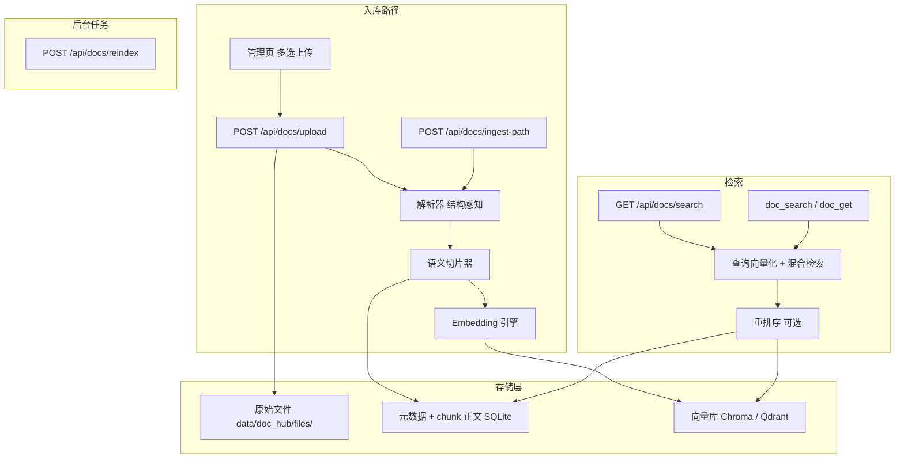

# DocHub 企业文档向量库 — 完整需求分析与设计方案

> 面向运维团队的企业级长文档知识检索系统，与现有 KnowledgeHub（短经验）**双轨并行**。  
> **版本：2.0**（整合语义切片、混合检索、开发/生产双模式、一键重建、知识调度层等增强）  
> 使用操作见 [doc-hub-user-manual.md](./doc-hub-user-manual.md)。  
> 实现代码：`chibycore/doc_hub/`、`terminal/mobile/doc_tools.py`、`terminal/web/doc_hub.html`。

**实现状态速览**

| 能力 | 状态 |
|------|------|
| 解析 / 切片 / Embedding（litellm·Ollama·hash）/ Chroma / SQLite / 上传·试搜 / `doc_search`·`doc_get` | **MVP 已落地** |
| 语义切片 `chunker_v2`、FTS5 混合检索、Rerank、Qdrant、一键 reindex | **v2.0 设计（待实现）** |
| 知识感知与自主调度（`search_knowledge`） | **设计稿（§15）** |

---

## 1. 项目背景与目标

### 1.1 现状与痛点

KnowledgeHub 擅长「症状→根因→修复」短条目，面对企业级长文档时短板明显：

| 痛点 | KnowledgeHub 现状 | DocHub 期望 |
|------|-------------------|--------------|
| 规模 | 全表内存打分，硬顶约 500 条 | 支持大规模 chunk 的高效检索 |
| 文档形态 | 结构化短字段 | 任意长度/格式长文，按段落/章节检索 |
| Agent 注入 | 整条经验塞入上下文 | 仅注入相关片段，可按需取全文 |

### 1.2 设计目标

1. **双轨并行**：DocHub 与 KnowledgeHub 独立存储、独立检索，互不污染。  
2. **单机可跑，按需扩展**：开发可用 Chroma（+ hash 降级）；生产可切高性能向量库。  
3. **语义精准**：向量检索解决关键词缺失；保留精确匹配（混合检索）。  
4. **降级可用**：无外网、无 GPU 仍能跑通检索闭环。  
5. **Agent 友好**：`doc_search` / `doc_get`；上层可接统一知识调度（§15）。

---

## 2. 与 KnowledgeHub 的关系

```text
KnowledgeHub  kb_*   →  data/knowledge_hub.db     （运维短经验）
DocHub        doc_*  →  data/doc_hub/*            （企业长文档）
```

API 前缀与工具名隔离。Agent 按问题类型选择；长期由 **§15 统一检索** 降低用户侧「指定查哪库」负担。  
Agent 工具入口在 `tools/plugins/`（`doc_search` / `doc_get` / `search_knowledge` / `get_content` 等）；`chibycore/doc_hub` 与 `terminal/mobile/doc_tools.py` 为实现库。
---

## 3. 总体架构

### 3.1 架构图



### 3.2 模块职责

| 模块 | 路径 | 职责 | 状态 |
|------|------|------|------|
| 解析 | `parse.py` | md/txt/pdf/docx → 文本（v2：结构化树） | MVP；结构树待增强 |
| 切片 | `chunker.py` / `chunker_v2.py` | 窗口切片 / 语义感知切片 | MVP / **待实现** |
| 向量化 | `embeddings.py` | litellm / Ollama / hash | 已落地 |
| 向量库 | `vector_store.py` | Chroma；Qdrant 统一接口 | Chroma 已落地；**Qdrant 待实现** |
| 元数据 | `storage.py` | SQLite 文档与 chunk | 已落地；`title_chain` 待加 |
| 流水线 | `ingest.py` | parse→chunk→embed→upsert，同名覆盖 | 已落地 |
| 检索 | `search.py` | 向量 TopK；混合+RRF+rerank | MVP；**混合待实现** |
| 重建 | `reindex_job.py` | 一键重建向量索引 | **待实现** |
| API | `api.py` | REST | 已落地；reindex 等待加 |
| Agent | `doc_tools.py` | `doc_search` / `doc_get` | 已落地 |
| UI | `doc_hub.html` | 上传/列表/试搜 | 已落地；重建按钮待加 |

---

## 4. 入库流水线（增强版）

### 4.1 基本步骤

1. 收文件（多文件上传、目录导入）  
2. 落副本：`data/doc_hub/files/{doc_id}{ext}`  
3. 解析 → `ParsedDocument`（§4.2）  
4. 切片（§4.3）  
5. 批量向量化（建议批大小 64）  
6. upsert 向量库  
7. SQLite 写文档 + chunk 全文  
8. 状态：`pending` → `ready` | `failed`

### 4.2 解析增强 — 结构化文档表示（设计）

```python
@dataclass
class Section:
    title: str
    level: int              # 0 = 根
    content: str            # 本节文本（不含子节）
    children: list[Section]

@dataclass
class ParsedDocument:
    title: str
    sections: list[Section]
```

- Markdown / docx：标题样式建树  
- PDF：字号启发式标题（`pdf_structure.py`，pypdf visitor；失败则扁平 + `structure_quality=low`）  
- 纯文本：整篇一节，空行分段  

### 4.3 切片升级 — 语义感知切片器（设计 · `chunker_v2`）

原则：结构为骨架，句子为原子，保持语义完整。

1. 递归遍历 Section，叶子注入**标题链**（如 `运维手册 > 数据库 > 重启`）  
2. 叶子 + 标题链 ≤ `target_max`（默认 800 字）→ 单 chunk  
3. 超长按句子切分，`target_min`～`target_max`，重叠以句子为单位  
4. chunk 带标题链与章节路径；`chunk_id = {doc_id}_{ordinal}`

相对旧窗口切片：少切断步骤/列表；结果可读；利于按章扩展上下文。

### 4.4 同名覆盖策略

以 **title 精确匹配**删除旧文档及向量/chunk，再新建（MVP 已落地）。未来可加内容哈希去重。

### 4.5 多文件处理

多文件**顺序**处理，避免 Ollama/Chroma 并发异常。大批量用 `ingest-path` 或任务队列。

### 4.6 入库质量门禁（设计）

- 解析后文本少于约 100 字符 → 失败并提示「可能为纯图/扫描件」  
- 平均 chunk 过短 → 提示切片异常  

---

## 5. 检索设计（增强版）

### 5.1 混合检索（设计）

纯向量对错误码/命令等精确术语召回弱。方案：

1. 向量检索（Chroma/Qdrant）+ 关键词（SQLite **FTS5**）并行  
2. **RRF** 或加权求和融合  
3. `HybridRetriever` 内置于 `search.py`

```sql
CREATE VIRTUAL TABLE chunks_fts USING fts5(chunk_id, text, title_chain);
```

### 5.2 Rerank（可选 · 设计）

混合 Top20 → 本地 Cross-Encoder（如 ms-marco-MiniLM）→ Top5。

### 5.3 上下文扩展（设计）

命中 chunk 后附带同文档前后邻居；更优：按标题链返回同节全部 chunk。

### 5.4 检索流程总览

```text
查询 → 查询重写(可选) → 向量 + FTS5 → RRF → Rerank → 上下文扩展 → 返回
```

建议 API 参数：

| 参数 | 默认 | 说明 |
|------|------|------|
| `strategy` | `hybrid` | `hybrid` \| `vector` \| `keyword` |
| `expand_context` | `true` | 邻块/同节扩展 |
| `enable_rerank` | `false` | 需本地 rerank 模型时开启 |

---

## 6. Agent 集成

### 6.1 工具定义

| 工具 | 确认卡 | 说明 | 状态 |
|------|--------|------|------|
| `doc_search(query, limit=5)` | 否 | TopK 片段 | 已落地 |
| `doc_get(doc_id?, chunk_id?)` | 否 | 取原文/片段 | 已落地 |

v2 增强建议：结果带 `title_chain`；`doc_get` 支持批量 `chunk_ids`。

### 6.2 Prompt

强化：「先 `doc_search`，再对相关 chunk `doc_get` 后作答」。  
用户无需说「查文档」的长期方案见 **§15**。

---

## 7. 向量库与元数据（双模式）

### 7.1 开发/测试模式（Chroma）— 已落地

- `pip install chromadb`；持久化 `data/doc_hub/chroma/`  
- 适合本地、PoC、离线  

### 7.2 生产模式（Qdrant）— 设计

```text
DOC_HUB_VECTOR_BACKEND=qdrant
QDRANT_URL=http://localhost:6333
```

单机百万级、低延迟；Docker 部署。

### 7.3 一键重建索引（设计）

切换向量后端或 embedding 维度时无需手工重传：

- `POST /api/docs/reindex`（可选 `wipe_vectors`）  
- 后台按原始文件重跑入库；`GET .../reindex/{job_id}/status`  
- UI：「重建向量索引」+ 进度  

实现：`reindex_job.py`。

### 7.4 元数据

SQLite `docs.db` 存文档列表与 chunk 全文。v2 增加 `title_chain` 字段。

---

## 8. Embedding 设计

### 8.1 多后端（已落地）

| 后端 | 配置 | 说明 |
|------|------|------|
| auto | `DOC_HUB_EMBEDDING_BACKEND=auto` | 有可用端点→litellm，否则 hash |
| litellm | 模型 + base_url + key | OpenAI 兼容 / Ollama |
| hash | — | 256 维词袋哈希，离线兜底 |

### 8.2 维度切换

`POST /api/docs/reload-embedding?wipe_vectors=true` 后执行 reindex；collection 按新维度重建（MVP 已有 reload/wipe 能力，与完整 reindex 任务衔接）。

### 8.3 降级

无凭据时用 hash；v2 结合 FTS5 仍可提供基础关键词检索。

---

## 9. 配置与部署指南

### 9.1 开发快速启动

```bash
# 依赖装在实际运行 uvicorn 的 venv
pip install chromadb pypdf python-docx litellm
# 启动 Assistant 后打开 /demo/doc-hub
# 默认 Chroma；无 Ollama 时 hash 降级亦可上传试搜
```

### 9.2 生产（Qdrant + Ollama embedding · 设计）

```bash
docker run -d --name doc-hub-qdrant \
  -p 6333:6333 \
  -v ./data/doc_hub/qdrant:/qdrant/storage \
  qdrant/qdrant:latest

export DOC_HUB_VECTOR_BACKEND=qdrant
export QDRANT_URL=http://localhost:6333
export DOC_HUB_EMBEDDING_BACKEND=litellm
export DOC_HUB_EMBEDDING_MODEL=nomic-embed-text
export DOC_HUB_EMBEDDING_BASE_URL=http://127.0.0.1:11434/v1
export DOC_HUB_EMBEDDING_API_KEY=ollama
```

管理页点「重建向量索引」迁移存量文档。

### 9.3 关键环境变量

| 变量 | 默认 | 说明 |
|------|------|------|
| `DOC_HUB_VECTOR_BACKEND` | `chroma` | `chroma` / `qdrant` |
| `DOC_HUB_EMBEDDING_BACKEND` | `auto` | `auto` / `litellm` / `hash` |
| `DOC_HUB_EMBEDDING_MODEL` | — | 如 `nomic-embed-text` |
| `DOC_HUB_EMBEDDING_BASE_URL` | — | Ollama 等 |
| `DOC_HUB_EMBEDDING_API_KEY` | — | 密钥 |
| `QDRANT_URL` | `http://localhost:6333` | Qdrant |

---

## 10. 性能与扩展性

### 10.1 容量规划

| 数据量 | 推荐 |
|--------|------|
| 小于 5 万 chunk | Chroma + 混合检索 |
| 5–20 万 | Chroma + metadata 过滤 |
| 20–100 万 | Qdrant + 混合检索 |
| 大于 100 万 | Qdrant 分片/量化或集群 |

### 10.2 入库 / 检索

- Embedding 有界并发；向量写入串行  
- Qdrant 百万级检索目标低于 100ms；混合整体可控制在约 200ms；Rerank 额外约 50–100ms  

---

## 11. API 设计概览

| 方法 | 路径 | 说明 | 状态 |
|------|------|------|------|
| GET | `/api/docs/stats` | 文档数、chunk 均长/方差、FTS 行数、向量后端、`reindex_in_progress` | 已落地 |
| GET | `/api/docs` | 文档列表 | 已落地 |
| GET | `/api/docs/search` | `strategy` / `expand_context` / `debug` / `rrf_k`（默认 RRF k=30） | 已落地 |
| POST | `/api/docs/upload` | 多文件上传 | 已落地 |
| POST | `/api/docs/ingest-path` | 目录导入 | 已落地 |
| POST | `/api/docs/reload-embedding` | 热重载 embedder | 已落地 |
| POST | `/api/docs/reindex` | 一键重建（内存 job；并发复用进行中任务） | 已落地 |
| GET | `/api/docs/reindex/{job_id}/status` | 重建进度 | 已落地 |
| DELETE | `/api/docs/{id}` | 删除 | 已落地 |

---

## 12. 管理界面

- `/demo/doc-hub`：上传、列表、试搜（已落地）  
- v2：重建按钮 + 进度；状态标识（待处理/就绪/失败/疑似扫描件）  

---

## 13. 优化路线图（分阶段）

### P0 — 解析与语料质量

- OCR 检测与提示  
- 解析后文本长度门禁  

### P1 — 语义切片 + 混合检索

- `chunker_v2`  
- FTS5 + Hybrid + 上下文扩展  

### P2 — 重排序与 Agent

- Cross-Encoder Rerank  
- Prompt 强化；对接 §15 统一检索  

### P3 — 双模式与一键迁移

- `QdrantVectorStore`  
- `reindex_job` + UI  

### P4 — 工程化

- 入库队列与进度推送  
- 多租户 metadata  
- 章节导航与原文定位  

---

## 14. 附录

### 14.1 代码结构

```text
chibycore/doc_hub/
  __init__.py
  models.py
  parse.py
  chunker.py           # MVP
  chunker_v2.py        # 待实现
  embeddings.py
  vector_store.py      # Chroma；Qdrant 待加
  storage.py
  ingest.py
  search.py            # 混合检索待增强
  reindex_job.py       # 待实现
  api.py

terminal/mobile/doc_tools.py
terminal/web/doc_hub.html
terminal/main.py       # /api/docs + /demo/doc-hub
tests/test_doc_hub.py

# §15 知识调度（待实现）
chibycore/knowledge_orchestrator/
terminal/mobile/orchestrator_tools.py
tests/test_knowledge_orchestrator.py
```

### 14.2 依赖

- 核心：`chromadb`、`litellm`、`pypdf`、`python-docx`  
- 生产可选：`qdrant-client`  
- 可选：`sentence-transformers`（Rerank）、`jieba`  

---

## 15. 知识感知与自主调度层（Knowledge Orchestration Layer）

> **状态**：设计稿。解决「必须说在文档中查找」的生硬交互。  
> **原则**：kb/doc 内核不变；其上增加统一检索与元认知提示。

### 15.1 问题与目标

用户不应承担「要不要查资料、查哪个库」；Agent 自主决策。目标：零指令交互、源透明、自我修正、可扩展新源（CMDB/工单等）。

### 15.2 统一接口

```text
search_knowledge(query, sources=["kb","doc"], limit=5) -> list[KnowledgeSnippet]
get_content(full_id) -> KnowledgeContent
```

- 并行 `kb_search` + `doc_search` → 标准化 Snippet → **RRF** 融合  
- `full_id`：`kb:…` / `doc:chunk:…` / `doc:doc:…` → 路由 `kb_get` / `doc_get`  

### 15.3 Agent 元认知（摘要）

默认保守、主动查证、溯源作答、片段不够则 `get_content`、允许改写 query 再搜。  
故障短映射偏 KH；手册/规范偏 DocHub；不确定双源。

### 15.4 落点与分期

| 阶段 | 交付 |
|------|------|
| D0 | Prompt「主动查证」+ 明示双工具 |
| D1 | `search_knowledge` + RRF + `get_content` |
| D2 | preamble 主推统一工具 |
| D3 | 新源适配器；调度试搜页 |

实现时以 `chibycore/knowledge_orchestrator` + Agent 工具挂接为准；与 DocHub 内核解耦。

---

*文档版本：2.0 · 覆盖开发/生产双模式、语义切片、混合检索、一键重建、扩展性规划与知识调度层；并标注 MVP 已落地范围。实现优化时请同步更新状态表与路线图。*
