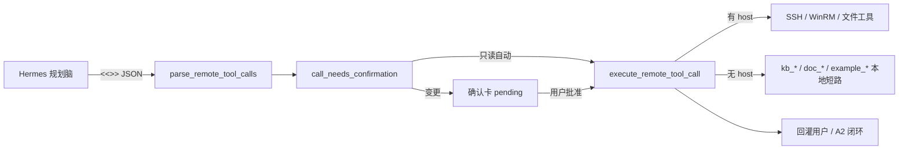

# 扩展与替换 Agent 工具能力 — 说明书

> 面向后期加新工具、换实现、收紧白名单时的操作手册。  
> 契约背景：ADR-0003（远端工具化）/ ADR-0004（模式与 A1·A2）。  
> 运行时核心：`terminal/mobile/remote_tools.py` + `orchestrator.py`。

配套文档：

- [tool-plugin-delivery-handbook.md](./tool-plugin-delivery-handbook.md) — **交付一册**：契约 + 迁移清单 + 全量工具表  
- [tool-plugin-architecture.md](./tool-plugin-architecture.md) — **优先：目录即插件**（本地工具推荐路径）  
- [doc-hub-technical-design.md](./doc-hub-technical-design.md) — 企业文档库 **v2.0** 完整设计（含 **§15 知识调度** / `search_knowledge`）  
- [knowledge-hub-user-manual.md](./knowledge-hub-user-manual.md) — 运维知识库  
- [chiby-technical-whitepaper.md](./chiby-technical-whitepaper.md) — 产品总览  

开源友好入口：

| 入口 | 说明 |
|------|------|
| **插件目录（推荐）** | [`tools/plugins/`](../tools/plugins/) — `manifest.yaml` + `handler.py`，自动发现 |
| Hello World | `tools/plugins/example_echo/`（兼容 re-export：`terminal/mobile/example_tools.py`） |
| 社区贡献区 | [`tools/contrib/`](../tools/contrib/README.md)（登记 + 审核，默认不自动执行） |
| 工具市场预览 | 浏览器打开 `/demo/tools-marketplace`（数据来自 `GET /api/tools/catalog`） |

> **本地新工具请走插件目录**，无需改 `remote_tools.py` / `config.py` / `orchestrator.py`。  
> 下文 §5「显式注册 Checklist」仅用于 **主机工具** 或尚未迁移的内置能力。

---

## 0. Hello World：十分钟走通一次

目标：新增一个**本地只读**工具（对照已合入的 `example_echo`）。

```text
<<<REMOTE_TOOL>>>
{"tool":"example_echo","text":"hello chiby"}
<<<END_REMOTE_TOOL>>>
```

**推荐路径（插件化，0 处系统文件改动）：**

1. 复制 `tools/plugins/example_echo/` → `tools/plugins/<your_id>/`  
2. 改 `manifest.yaml`（`name` / 参数 / `usage_example`，`status: approved`）  
3. 实现 `handler.py` 的 `run`（可选 `format_result`）  
4. 重启 Assistant；全能型发上述块验证  

契约细节见 [tool-plugin-architecture.md](./tool-plugin-architecture.md)。

**遗留显式注册清单**（仅对照历史 / 主机工具）见 §5.1。

掌上 IM / 全能型一轮手工：应直接看到回显，无 SSH、无确认卡。

社区提案：先按 [`tools/contrib/_template/`](../tools/contrib/_template/) 登记（`proposed`）；维护者审后晋升到 `tools/plugins/` 并设 `status: approved`。

---

## 1. 工具在系统里扮演什么角色

掌上 / Hermes 规划脑**不直接拿主机密码**。它只输出契约块：

```text
<<<REMOTE_TOOL>>>
{"tool":"ssh_execute","host":"<host_id>","command":"df -h"}
<<<END_REMOTE_TOOL>>>
```

Assistant 负责：

1. **解析** JSON（白名单过滤、拒收密钥字段）  
2. **确认卡**（变更/高危）  
3. **执行**（SSH/WinRM 无头，或本地库短路）  
4. **回灌**结果给用户 / 闭环给 Hermes  

因此「加能力」= 在这条链路上挂一个新的 `tool` 名，而不是给模型塞 shell 脚本。



---

## 2. 现有工具分类（选型时先对号入座）

| 类型 | 例子 | 要不要 host | 默认确认卡 | 执行位置 |
|------|------|-------------|------------|----------|
| 主机只读 | `ssh_execute`（查状态）、`remote_read_file`、`remote_list_dir` | 要 | 通常否* | 远端 |
| 主机变更 | `remote_write_file`、`remote_remove`、危险 shell | 要 | 是 / 按模式 | 远端 |
| 本地只读 | `kb_search`、`kb_get`、`doc_search`、`doc_get`、`host_list`、`example_echo` | 不要 | 否 | Assistant 进程内 |
| 本地写入 | `kb_ingest` | 不要 | **始终是** | Assistant 进程内 |

\*智能型对受控变更仍可能确认；全能型高危仍确认。见 `call_needs_confirmation()`。

**模式与通道（ADR-0004）**：

| 模式 | 工具通道 | 说明 |
|------|----------|------|
| 高效型 | 关 | 基本不走 REMOTE_TOOL |
| 智能型 | 关（例外：仅 `kb_*` 的 local_kb_only） | 默认走 OPS 闭环 |
| 全能型 | 开（A2） | 单脑 REMOTE_TOOL，闭环回灌 |

> yaml 里 `remote_tools.enabled` **不能**单独把智能型变成 A2；以 `agent_mode` 为准。

---

## 3. 端到端数据流（加工具前先读懂）

| 步骤 | 文件 | 函数 / 位置 |
|------|------|-------------|
| 加载白名单 | `terminal/hermes_bridge/config.py` | `RemoteToolsConfig`、`load_hermes_bridge_config` |
| 注入 prompt | `terminal/hermes_bridge/acp_worker.py` | preamble + `remote_tools_preamble_addon` |
| 协议说明 | `terminal/mobile/hermes_protocol.py` | `advanced_protocol_preamble` |
| 解析 | `terminal/mobile/remote_tools.py` | `parse_remote_tool_calls` → `_normalize_call` |
| 分发执行 | `terminal/mobile/orchestrator.py` | `_maybe_finish_remote_tools` |
| 确认判定 | `remote_tools.py` | `call_needs_confirmation` |
| 真正执行 | `remote_tools.py` | `execute_remote_tool_call` |
| 挂起/批准 | `remote_tools.py` + orchestrator | `remote_tool_call_to_pending_dict` / `from_pending_dict` |

解析规则要点：

- 工具名必须在 **allowed_tools** 内，否则静默丢弃。  
- JSON 里出现 `password` / `secret` 等键 → 整段拒绝。  
- 别名：`remote_search`→`remote_grep`，`remote_rollback`→`remote_restore`。

---

## 4. 配置：如何「只换白名单、不改代码」

文件：`data/hermes_bridge.yaml`

```yaml
remote_tools:
  # enabled / prefer_over_ops_plan：遗留字段；通道仍由 agent_mode 强制
  allowed_tools:
    - host_list
    - kb_search
    - kb_get
    - doc_search
    - doc_get
    - ssh_execute
    - winrm_execute
    # …按需增减；这是「整表替换」，不是 merge
```

| 操作 | 做法 |
|------|------|
| 收紧能力 | 从 `allowed_tools` 去掉某工具名 |
| 放开能力 | 把工具名加进列表（且代码里已实现） |
| 恢复默认 | 删除或注释整个 `allowed_tools` 段 |

注意：

- orchestrator / acp_worker 会**强制把 `kb_*` 并回白名单**；`doc_*` **没有**同等强制，自定义列表漏写会导致 doc 工具解析失败。  
- 改 yaml 后需**重启** Assistant。

代码内默认全集见：`remote_tools.DEFAULT_ALLOWED_TOOLS`（与 `config.RemoteToolsConfig` 默认应对齐）。

---

## 5. 新增工具：三类 Checklist

下面三套清单互斥选型；做完一类即可。

### 5.1 本地无 host 工具（推荐范式：`tools/plugins/`）

适合：查本地库、调本机服务、不碰目标机。参考：`kb_search` / `doc_search` / `example_echo`。

**首选（插件目录）：**

1. 复制 `tools/plugins/example_echo/` → `tools/plugins/<your_id>/`，改 `manifest.yaml` + `handler.py`  
2. 复杂业务可放在 `terminal/mobile/<name>_tools.py`，handler 只做委托  
3. 若需默认白名单：把名字加入 `DEFAULT_ALLOWED_TOOLS`（并加入 `MIGRATED_LOCAL_PLUGIN_TOOLS` 以免被 reserved 挡住）  
4. 测试：`tests/test_tool_plugins.py` 风格（`is_plugin_tool`、executor 不得被调用）

**兼容回退（仅当插件关闭）：** `execute_remote_tool_call` 仍可直调库模块；新工具一般不必再写硬编码分支。

**仍可能要碰的系统点（按需）：**

- 确认卡字段拷贝（写入类，仿 `kb_ingest`）  
- `remote_tools_preamble_addon` / 智能型 `local_kb_only` 旁路 / A2 只读判定  
- `hermes_bridge` 默认白名单

**反例坑：** 若仍写硬编码执行路径，短路必须在 host 校验之前，否则会 `host_required`。

### 5.2 主机只读工具

**必做：**

1. `DEFAULT_ALLOWED_TOOLS` + config 默认 +（可选）yaml 示例注释  
2. 若属文件类：加入 `FILE_TOOLS` + `FILE_READONLY_TOOLS`，并在 `build_file_tool_command` 实现 SSH/WinRM 两侧命令  
3. 若属 shell：走现有 `ssh_execute` / `remote_run` 模式，或新 tool 名编译为 command  
4. `call_needs_confirmation` → False  
5. `remote_tools_preamble_addon` 示例（带 `host`）  
6. 可选：`_a2_tool_is_pure_readonly`  
7. 测试：parse + execute（fake executor）+ 无确认  

### 5.3 主机变更工具

在 5.2 基础上额外：

1. `call_needs_confirmation` → True，或加入 `FILE_ALWAYS_CONFIRM`  
2. `remote_tool_call_to_pending_dict` / `from_pending_dict` 字段完整往返  
3. 多机：`hosts` + `expand_batch_mutate_to_per_host`（如写文件分发）  
4. 写文件注意附件：`attachment_id`、分块 `OPS_MOBILE_WRITE_CHUNK_KB`、自动备份 `OPS_MOBILE_AUTO_BACKUP`  
5. 测试：确认卡 + pending 往返 + 多机展开（如需要）  

---

## 6. 替换已有工具（不改名 / 改名）

| 目标 | 做法 |
|------|------|
| 换实现、工具名不变 | 只改 `execute_remote_tool_call` 分支或底层 runner；prompt 可不动 |
| 改名 / 废弃旧名 | `_normalize_call` 加别名映射；白名单保留新名；preamble 改示例 |
| 收紧某能力 | yaml `allowed_tools` 去掉该名（整表替换） |
| 用新工具替代旧工具 | 实现新工具 → 白名单只留新名 → preamble 只教新名 → 观察一段时间再删旧分支 |

**不要**在工具参数里传密码；凭据永远 `host_id → hosts.json`。

---

## 7. Prompt 三处同步（最容易漏）

模型「会不会用」取决于它是否在系统提示里看到工具：

| # | 位置 | 作用 |
|---|------|------|
| 1 | `DEFAULT_ALLOWED_TOOLS` / yaml `allowed_tools` | 解析放行 |
| 2 | `remote_tools_preamble_addon()` | A2 动态说明书（按白名单拼块） |
| 3 | `hermes_protocol.advanced_protocol_preamble` | 高级协议里的固定说明 |

只改 1 不改 2/3 → 工具「存在但模型不知道」；只改 2/3 不改 1 → 模型会写、解析会丢。

---

## 8. 最小代码骨架（本地只读工具）

```python
# terminal/mobile/foo_tools.py（示意）
FOO_TOOLS = frozenset({"foo_search"})
FOO_READONLY_TOOLS = frozenset({"foo_search"})

def run_foo_search(*, q: str, limit: int = 8) -> dict:
    if not (q or "").strip():
        return {"ok": False, "error_code": "query_required", "error": "缺少 q"}
    # ... 查本地服务 ...
    return {"ok": True, "hits": [...]}

def format_foo_result_summary(data: dict) -> str:
    ...
```

在 `execute_remote_tool_call` 中（**紧挨 kb/doc 短路之后、hosts 解析之前**）：

```python
if tool == "foo_search":
    from terminal.mobile.foo_tools import run_foo_search, format_foo_result_summary
    data = run_foo_search(q=..., limit=...)
    return RemoteToolResult(
        tool=tool,
        ok=bool(data.get("ok")),
        stdout=format_foo_result_summary(data),
        data=data,
        exit_code=0 if data.get("ok") else -1,
        ...
    )
```

---

## 9. 测试怎么写（建议最低集）

```text
tests/test_foo_tools.py
  ✓ "foo_search" in DEFAULT_ALLOWED_TOOLS
  ✓ parse_remote_tool_calls 能解析 REMOTE_TOOL 块
  ✓ call_needs_confirmation(...) is False（只读）
  ✓ execute_remote_tool_call 时传入会 raise 的 executor → 不应被调用
  ✓ error_code != "host_required"
  ✓ （写入类）pending dict 往返保留业务字段
```

参考：

- `tests/test_remote_tools_adr0003.py` — 契约与主机工具  
- `tests/test_kb_tools.py` — 本地知识库  
- `tests/test_doc_hub.py` — 企业文档工具  

---

## 10. 常见陷阱

1. **确认后字段丢失** — pending 未写入 `title`/`q` 等 → 批准后 `fields_required`（kb_ingest 踩过）。  
2. **确认卡误挂主机** — 本地工具未加入 orchestrator 豁免元组。  
3. **`host_required`** — 本地工具短路太晚。  
4. **白名单漂移** — DEFAULT / config 默认 / yaml / preamble 四处不一致。  
5. **智能型用不了 doc** — 仅 kb 有 `local_kb_only`；新本地工具若要在智能型可用，需显式旁路。  
6. **yaml 漏 doc** — 不会像 kb 被强制 merge。  
7. **A2 纯只读检查点** — `_a2_tool_is_pure_readonly` 未收录的工具可能多弹「继续」。  
8. **误信 `remote_tools.enabled`** — 改 yaml 不会让智能型变全能型。  
9. **A2 下同轮 OPS_*** — 会被忽略（单脑契约）。  
10. **大附件写文件** — pending 只挂 `attachment_id`，批准后再解析内容。

---

## 11. 环境变量与旋钮（扩展时可能碰到）

| 旋钮 | 作用 |
|------|------|
| 会话 `agent_mode` | 是否走 A2 工具通道 |
| `data/hermes_bridge.yaml` → `allowed_tools` | 白名单整表 |
| `OPS_MOBILE_A2_LOOP_CAP` | 闭环轮次上限 |
| `OPS_MOBILE_A2_READONLY_CAP` | 纯只读延长上限 |
| `OPS_MOBILE_WRITE_CHUNK_KB` | 大文件分块写 |
| `OPS_MOBILE_AUTO_BACKUP` | 写前自动备份 |
| `mobile_demo.executor` | `real` / `fake` |

DocHub 专用见 [doc-hub-technical-design.md](./doc-hub-technical-design.md)（`DOC_HUB_EMBEDDING_*` 等）。

---

## 12. 推荐落地流程（团队协作）

```text
1. 定类型：本地只读 / 本地写入 / 主机只读 / 主机变更
2. 起 tool 名（稳定、可文档化；避免与 shell 语义混淆）
3. 写 runner + execute 短路或文件编译
4. 同步白名单三处 + preamble 两处
5. 补 orchestrator 确认卡 / 只读闭环（如需要）
6. 单测 + 掌上 IM 手工一轮（确认卡文案、无 host 展示）
7. 若要收紧生产面：yaml allowed_tools 裁剪后发布
8. （可选）工具市场 catalog / contrib MANIFEST 登记，方便社区发现
```

---

## 13. 社区贡献与工具市场

| 路径 | 职责 |
|------|------|
| `tools/contrib/README.md` | 贡献规范与审核底线 |
| `tools/contrib/MANIFEST.json` | 社区登记元数据（市场页读取） |
| `tools/contrib/_template/` | 提案目录模板 |
| `terminal/tools_catalog.py` | 官方列表 + 合并 MANIFEST → JSON |
| `GET /api/tools/catalog` | 市场数据 API |
| `/demo/tools-marketplace` | 静态预览页 |

约定：

- **展示 ≠ 执行**：市场页列出的社区条目默认不会进 `allowed_tools`。  
- 维护者合入运行时后，再把 MANIFEST `status` 改为 `accepted`，并同步官方 catalog / 代码。  
- 审核重点：密钥不进参数、本地短路位置、确认卡策略、最小测试。

---

## 14. 代码索引

| 路径 | 职责 |
|------|------|
| `terminal/mobile/remote_tools.py` | 白名单、解析、确认、执行、preamble、pending |
| `terminal/mobile/orchestrator.py` | 回合收尾、确认卡、A2 闭环 |
| `terminal/mobile/hermes_protocol.py` | 高级协议文案 |
| `terminal/hermes_bridge/config.py` | yaml → RemoteToolsConfig |
| `terminal/hermes_bridge/acp_worker.py` | 组装系统 preamble |
| `terminal/mobile/agent_mode.py` | 模式 → 是否开 remote_tools |
| `terminal/mobile/kb_tools.py` | KnowledgeHub 本地工具 |
| `terminal/mobile/doc_tools.py` | DocHub 本地工具 |
| `terminal/mobile/example_tools.py` | Hello World 兼容 re-export（实现在 plugins） |
| `terminal/tools_plugin_loader.py` | **插件发现 / 注册表 / 执行** |
| `tools/plugins/*/manifest.yaml` | 插件元数据 |
| `tools/plugins/*/handler.py` | 插件实现 |
| `terminal/tools_catalog.py` | 工具市场目录 |
| `data/hermes_bridge.yaml` | 运行时白名单覆盖（`plugin_auto_merge`） |
| `tests/test_remote_tools_adr0003.py` | 契约测试 |
| `tests/test_tool_plugins.py` / `test_example_tools.py` / `test_kb_tools.py` / `test_doc_hub.py` | 本地工具范式 |

---

*文档版本：与当前 REMOTE_TOOL 契约、kb/doc 双本地库、example_echo、contrib 市场预览、A1/A2 模式分层对齐。新增工具后请同步更新本节「现有工具分类」与测试索引。*
