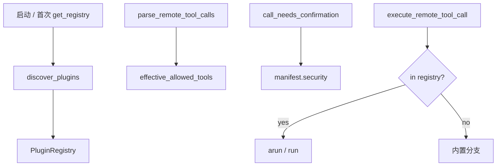

# 工具目录插件化架构

> 目标：把「改 6 个系统文件」变成「往目录里放 `manifest.yaml` + `handler.py`」。  
> 契约背景：ADR-0003 / [extending-agent-tools.md](./extending-agent-tools.md)。  
> 状态：**Phase 1–6 + 集成验收已落地**。  
> **交付收成一册**（契约摘要 + 迁移清单 + 工具表）：[tool-plugin-delivery-handbook.md](./tool-plugin-delivery-handbook.md)。

---

## 1. 目录约定

```text
tools/
├── plugins/                 # 已审核、可加载执行
│   └── <tool_id>/
│       ├── manifest.yaml
│       └── handler.py
├── contrib/                 # 社区提案（不自动 import）
│   ├── MANIFEST.json
│   └── ...
└── （主机类仍在 terminal/mobile/remote_tools.py）
```

| 目录 | 是否 import | 用途 |
|------|-------------|------|
| `tools/plugins/` | 是（`status: approved`） | 全部本地知识/文档/示例工具 + 扩展 |
| `tools/contrib/` | 否 | 提案 + 市场展示 |
| `terminal/mobile/kb_tools.py` / `doc_tools.py` / `orchestrator_tools.py` | 是 | **实现库**（由插件 handler 调用） |
| `terminal/mobile/remote_tools.py` | 是 | 主机类工具硬编码 + 插件调度 |

### 迁移策略（现行）

| 迁入 `tools/plugins/` | 保持硬编码（非插件）直至 Phase 3+ |
|----------------------|--------------------------------------|
| `kb_*` / `doc_*` / `search_knowledge` / `get_content` / `host_list` / `example_echo` | 全部主机类 `ssh_*` / `winrm_*` / `remote_*` |
| 社区审核通过的本地插件 | （主机迁入节奏见 [host-plugin-contract.md](./host-plugin-contract.md)） |

本地知识与文档已是**通用插件**：业务在 `*_tools.py`，Agent 侧由 `tools/plugins/` 自动发现；`OPS_TOOL_PLUGINS=0` 时仍回退到库模块直调。主机工具因命令编译/多机/附件仍走 `remote_tools.py`——**先定契约再搬**，避免拆碎执行内核。

`host_list` 通过 `context["list_visible_hosts"]` 注入可见主机回调，handler **不读** hosts 凭据。
---

## 2. Manifest 契约（Phase 1）

```yaml
name: example_echo                 # 必须与目录名一致
description: 回显文本（Hello World）
version: "1.0.0"
author: chiby-maintainers
type: local_readonly               # local_readonly | local_write
host_required: false               # Phase 1 必须为 false
status: approved                   # 仅 approved 加载
parameters:
  - name: text
    type: string
    description: 要回显的字符串
    required: true
security:
  risk_level: low                  # low | medium | high | critical
  needs_confirmation: false
  read_only: true
executor:
  type: python_function
  entry: run                       # handler 中的函数名
usage_example: |
  {"tool":"example_echo","text":"hello chiby"}
```

加载拒绝条件：

- `status != approved`
- `type` 以 `host_` 开头（Phase 1）
- `host_required: true`
- 参数名含 `password` / `secret` / `token` / `api_key`
- 与内置 `DEFAULT_ALLOWED_TOOLS` **同名** → **builtin 优先**，插件跳过并 warning
- handler 路径不在 `tools/plugins/<name>/handler.py`

---

## 3. Handler 契约

```python
def run(params: dict, context: dict) -> dict:
    """返回 {ok: bool, error?: str, error_code?: str, ...}"""
    ...

# 可选
async def arun(params: dict, context: dict) -> dict: ...
def format_result(data: dict) -> str: ...
```

`context` Phase 1 注入：`agent_mode`、`raw`；按需注入无凭据回调（如 `list_visible_hosts`）。**不**把 hosts 密码塞进 params。

---

## 4. 运行时挂接

| 能力 | 实现 |
|------|------|
| 发现 | `terminal/tools_plugin_loader.py` → `get_registry()` |
| 白名单 | `effective_allowed_tools()` = builtin ∪ plugin ids（`plugin_auto_merge`） |
| 确认卡 | `call_needs_confirmation` 读 `security.needs_confirmation` |
| 执行 | `execute_remote_tool_call` 在 host 解析前查 registry |
| Prompt | `remote_tools_preamble_addon` 拼接各插件 `usage_example` |
| A2 只读 | `_a2_tool_is_pure_readonly` → `plugin_is_readonly` |
| 确认卡 host | orchestrator：插件且 `host_required=false` 不绑 mut_host |



---

## 5. 环境变量 / 配置

| 旋钮 | 默认 | 作用 |
|------|------|------|
| `OPS_TOOL_PLUGINS` | `1` | `0` 关闭动态加载 |
| `OPS_TOOL_PLUGINS_DIR` | `<repo>/tools/plugins` | 扫描根目录 |
| `remote_tools.plugin_auto_merge` | `true` | yaml 白名单自动并入 approved 插件 id |

---

## 6. 如何新增一个本地工具（推荐路径）

1. 复制 `tools/plugins/example_echo/` 为 `tools/plugins/<your_id>/`
2. 改 `manifest.yaml` 的 `name` / 参数 / `usage_example`
3. 实现 `handler.py` 的 `run`（可选 `format_result`）
4. 重启 Assistant
5. 全能型发 `<<<REMOTE_TOOL>>>` 验证；看 `/demo/tools-marketplace`

**不需要**改 `remote_tools.py` / `config.py` / `orchestrator.py`。

遗留「显式注册」Checklist（主机工具 / 未迁内置）仍见 [extending-agent-tools.md](./extending-agent-tools.md) §5。

---

## 7. 分期

| 阶段 | 内容 | 状态 |
|------|------|------|
| Phase 1 | 本地插件 loader + kb/doc/orch/host_list/example_echo | **已落地** |
| Phase 2 | **主机插件契约**（不拆执行内核；薄 handler） | **契约已定** → [host-plugin-contract.md](./host-plugin-contract.md) |
| Phase 3 | 主机只读文件工具全部迁入 plugins | **已完成** |
| Phase 4 | 主机写入 + 确认卡（write/mkdir/remove/restore） | **已完成** |
| Phase 5 | 命令面 execute 三件套已迁；`*_batch` **刻意暂留**内核 | **主体完成** |
| Phase 6 | 工具市场深化：发现 / 版本 / 依赖声明 / 技能包 | **已落地** → [tool-marketplace-phase6.md](./tool-marketplace-phase6.md) |
| 集成验收 | 真实场景串插件全链路（mock SSH） | **已落地** → [tool-plugin-integration-tests.md](./tool-plugin-integration-tests.md) |
| **交付一册** | 契约 + 迁移清单 + 工具表收成 | **已成册** → [tool-plugin-delivery-handbook.md](./tool-plugin-delivery-handbook.md) |
| 后续 | 依赖门禁 / 交付包（可选） | 待定 |

`remote_tools.py` 角色：**调度器 + 共享依赖**（非工具大本营）。

本地增强（智能型旁路、市场分层、contrib 晋升）可与 Phase 2–3 并行，**不替代**主机契约。

---

## 8. 代码索引

| 路径 | 职责 |
|------|------|
| `terminal/tools_plugin_loader.py` | 发现、注册表、执行 |
| `tools/plugins/*/manifest.yaml` | 元数据 |
| `tools/plugins/*/handler.py` | 实现 |
| `terminal/mobile/remote_tools.py` | 白名单合并 / confirm / execute / preamble |
| `terminal/mobile/orchestrator.py` | mut_host / A2 readonly |
| `terminal/tools_catalog.py` | 市场目录合并插件 |
| `tests/test_tool_plugins.py` | 插件契约测试 |
